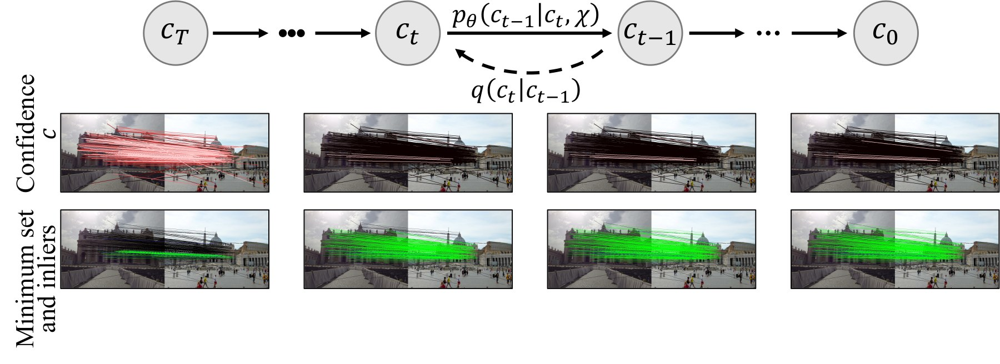
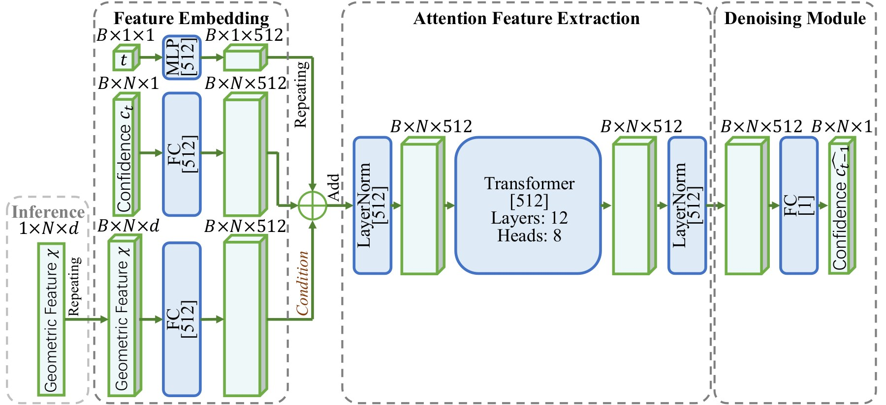
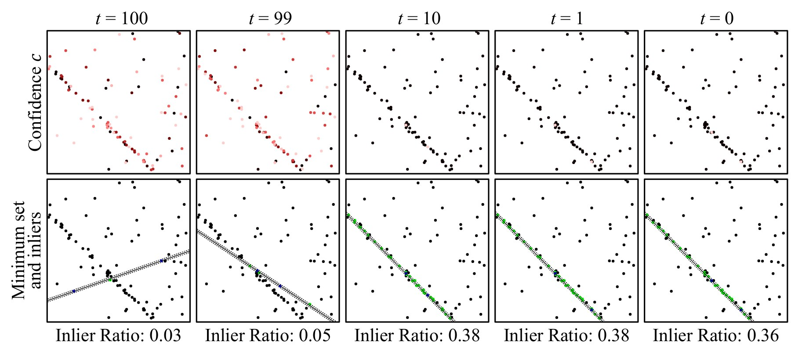
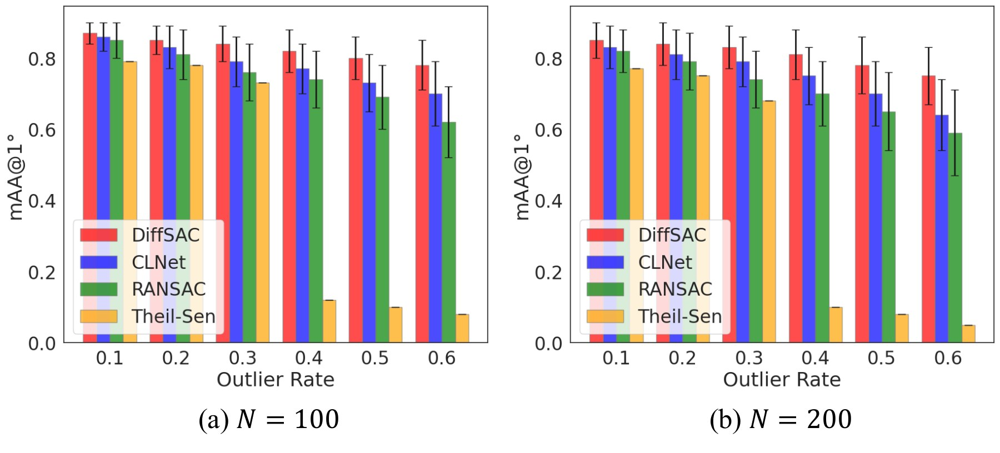
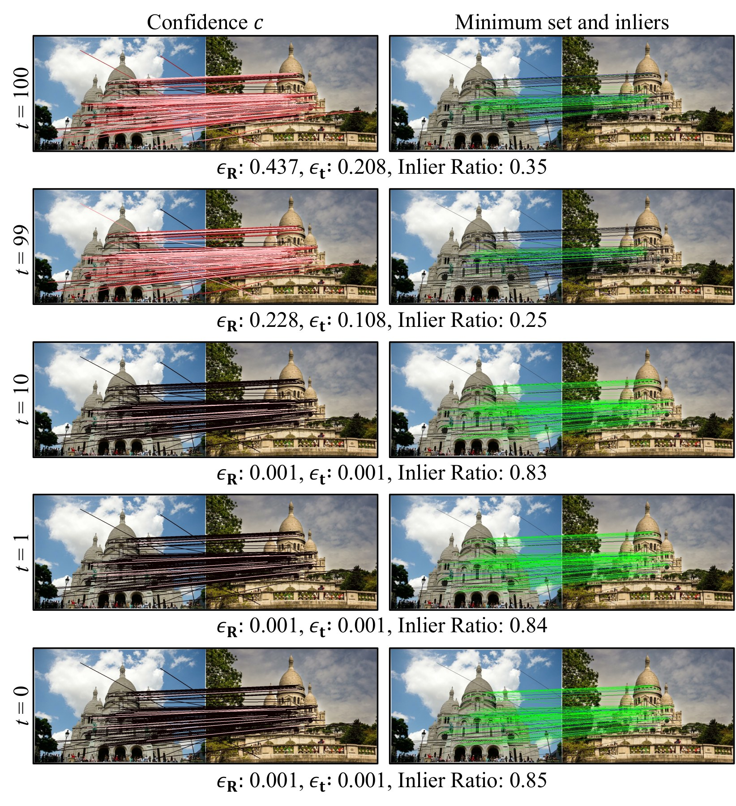
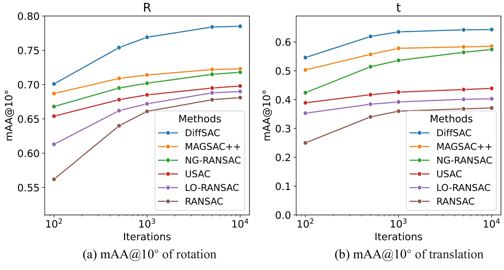

## 一页速览

| 问题 | DiffSAC 的回答 |
|---|---|
| 生成什么？ | 生成置信度场，其最高项共同组成有效几何最小集 |
| 为什么使用扩散？ | 条件迭代细化可表达多个联合有效集合，而非一次固定排序 |
| 哪些部分保持经典？ | 最小求解器、共识评分与可选局部优化 |
| 验证范围 | 直线/平面拟合、基础/本质矩阵与单应性估计 |
| 状态 | 预印本；投稿 IJCV 审稿中 |

采样一致性只有在提出的最小集与目标几何**联合相容**时才会成功。一个点单独看可能很可靠，与其他高分点组合却很差：两个几乎重合的点会让直线拟合不稳定，重复对应关系可能使八点法退化，一次确定性排名在最高组合失败后也缺少多样性。

DiffSAC 把采样视为条件生成。它不只为每个点打一次分，而是学习置信度场的分布，并通过逆扩散反复细化。多个随机噪声种子由此产生少量而多样的候选集合。

## 共识估计主体仍然模块化

给定观测 $\chi$ 与最小集 $\mathcal{M}_j$，任务求解器构造 $h_j=S(\mathcal{M}_j)$，共识函数评价 $f(h_j,\chi)$，最终估计仍是

$$
h_{\mathrm{best}}
=\arg\max_{j=1,\ldots,J} f\!\left(S(\mathcal{M}_j),\chi\right).
$$

DiffSAC 只改变 $\mathcal{M}_j$ 如何提出，不改变直线、平面、基础矩阵、本质矩阵或单应性的定义。这保留了与现有求解器的兼容性，也允许在采样后加入 LO-RANSAC 等局部优化。

## 置信度是集合属性

记 $c_0$ 为观测 $\chi$ 条件下的目标置信度场。训练时，前向扩散把它污染成 $c_t$；Transformer 学习逆条件

$$
p_\theta(c_{t-1}\mid c_t,\chi).
$$

去噪器以指向 $c_0$ 的均方误差训练。网络不使用位置编码，因此对输入排列不变，也能接受不同数量的观测；注意力使每个候选的置信度可根据集合中其他元素而改变。

这里的置信度不能解释为独立内点概率。它表达的是：在当前生成提议下，一个观测是否属于某个**良好的联合最小集**。不同逆扩散轨迹可以强调不同但各自相容的子集。

## 训练与推理

训练 100 个 epoch，采用 Adam、学习率 $10^{-4}$ 与余弦调度，硬件为 RTX 4090；DPM-Solver++ 用于加速逆过程。

推理时把观测复制 $\kappa=20$ 份，每份从独立高斯噪声 $c_T$ 出发，经过 $T=100$ 次逆向细化。每个最终置信度场取最高的 $\gamma$ 个观测组成候选最小集，其中 $\gamma$ 是求解器所需的最少样本数。经典求解器评价 20 个假设并保留最佳共识。

20 有意远小于均匀 RANSAC 的数千次抽样。学习式生成器对每次提议投入更多计算，以换取更高的单次有效性。

## 合成直线与平面拟合

直线拟合使用 $N=100$、最小集大小 $\gamma=2$，外点率从 10% 到 80%。最困难报告设置如下：

| 80% 外点 | mAA $\uparrow$ | 中位误差 $\downarrow$ |
|---|---:|---:|
| RANSAC | 0.30 | $0.31^\circ$ |
| DiffSAC | **0.43** | **$0.20^\circ$** |

在 50% 外点下，RANSAC 为 0.78 mAA、$0.07^\circ$，DiffSAC 为 0.86、$0.05^\circ$。直线拟合报告吞吐率约为 GPU 50 Hz、CPU 30 Hz。

平面拟合使用 $N=100$ 与 $\gamma=3$。同一模型无需重训直接在 $N=200$ 上评测，用于检验 Transformer 的可变集合规模设计。

## 基础矩阵估计

对应点实验遵循 RANSAC tutorial 协议：12 个场景总计提供超过一百万个训练图像对，两个留出场景各有 4,950 个测试对。每个对应关系用坐标与 SIFT 描述子组成 260 维特征，几何后端使用八点法与 4 像素阈值。

| 方法 | 旋转 mAA $\uparrow$ | 平移 mAA $\uparrow$ | 旋转中位误差 $\downarrow$ | 平移中位误差 $\downarrow$ | 速度 |
|---|---:|---:|---:|---:|---:|
| MAGSAC++ | 0.723 | 0.585 | $1.476^\circ$ | $2.632^\circ$ | 53 Hz |
| DiffSAC | **0.783** | **0.641** | **$0.886^\circ$** | **$1.819^\circ$** | GPU 30 Hz |

该配置下，DiffSAC 相对 MAGSAC++ 用吞吐率换取精度，并不是“无成本加速”；优势是少量学习式假设能够在可交互速度下获得更高准确率。

## 本质矩阵、配准与单应性

本质矩阵采用五点法与 1 像素阈值：

| 方法 | 旋转 mAA | 平移 mAA | 旋转中位误差 | 平移中位误差 | 速度 |
|---|---:|---:|---:|---:|---:|
| MAGSAC++ | 0.778 | 0.553 | $1.195^\circ$ | $2.284^\circ$ | — |
| DiffSAC | **0.798** | **0.651** | **$0.863^\circ$** | **$1.779^\circ$** | GPU 48 Hz / CPU 22 Hz |

ModelNet40 配准在 60% 外点下，DiffSAC 旋转/平移 mAA 为 0.547/0.453，MAGSAC++ 为 0.524/0.438。单应性在 KITTI 上用 DLT 与 0.1 阈值评价；论文给出完整曲线，而不是只摘取一个工作点。

五类问题覆盖不同最小集大小、特征与求解器，支持采样模块化主张；但每项任务仍使用自己的训练模型与输入表达。

## 消融：增益究竟来自哪里

在基础矩阵估计上，一次性直接置信度预测的旋转/平移 mAA 为 0.687/0.393，扩散细化达到 0.783/0.641。DiffSAC 后加入 LO-RANSAC 可进一步达到 0.794/0.657，说明学习式采样与经典局部优化互补。

移除描述子后 mAA 降至 0.725/0.603；使用 SuperPoint 特征得到 0.787/0.646。网络对比中，无位置编码 Transformer 优于 MLP 与 DGCNN；最大置信集合选择优于论文所测其他采样方式。预算实验还显示，DiffSAC 在 2,000 次共识迭代下优于使用更多采样的报告 RANSAC 配置。

2,000 次迭代流程报告约 33 ms、约 2 GB GPU 显存。运行时间约 12% 用于预处理、75% 用于扩散、13% 用于共识评价。扩散显然是主要开销，也是未来加速的直接目标。

## 局限与 RLSAC 的关系

每个任务都需要合适训练数据和任务模型，直线采样器不会自动变成基础矩阵采样器。迭代生成增加 GPU 和延迟成本；没有匹配训练分布、硬件或显存时，经典估计器仍很有吸引力。性能也会受到“有效集合”训练目标构造方式影响。

RLSAC 根据先前几何假设的奖励学习序列提议；DiffSAC 从生成角度重问同一问题：哪些观测应当**一起**被选择？从强化学习到条件扩散体现了研究方法的演进，但不变的原则仍然是——采样应利用结构与反馈，而不是把每个假设都均匀地花掉。
