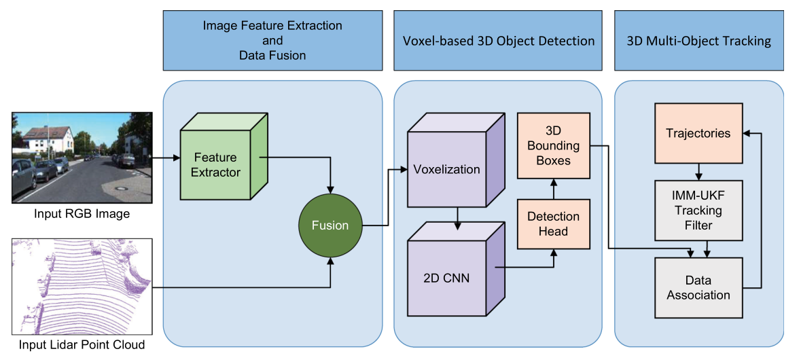
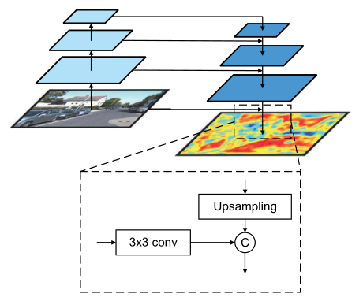
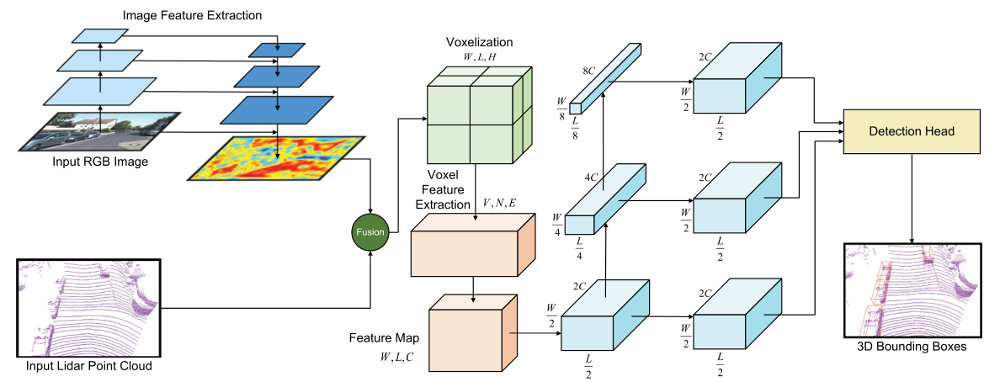
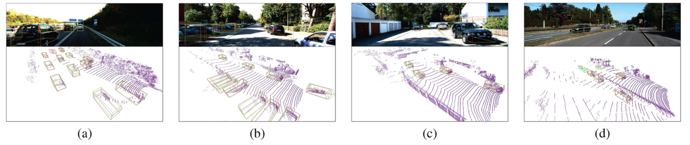
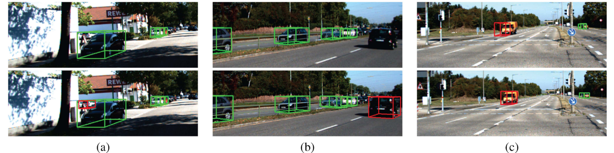

## 研究概览

| 问题 | DTFI 的处理方式 |
|---|---|
| 如何用图像补充稀疏点云？ | 将全分辨率图像特征附加到每个激光雷达点上 |
| 如何缓解局部投影偏差？ | 在投影位置附近使用 5 × 5 卷积窗口聚合特征 |
| 如何兼顾三维检测与运行效率？ | 将增强点云编码为柱状特征，再通过伪图像和二维卷积完成检测 |
| 如何同时适应直行与转弯？ | 通过 IMM-UKF 融合 CV/CTRV 模型，用匈牙利算法关联检测与轨迹 |
| 实验覆盖什么？ | KITTI Car 检测、目标跟踪、融合与滤波器消融，以及论文报告的 30 Hz 运行频率 |

**DTFI** 是融合检测与跟踪框架的简称。论文于 **2023 年 4 月 4 日在线发表**，收录于 *IEEE Transactions on Emerging Topics in Computational Intelligence* 2023 年 8 月第 7 卷第 4 期，页码 1242–1252。作者依次为 **Chang Nie、Zhiyang Ju、Zhifeng Sun、Hui Zhang**；Chang Nie 为第一作者，Hui Zhang 为通信作者。[出版信息](https://doi.org/10.1109/TETCI.2023.3259441)。

## 背景：相邻两帧之间，车辆已经移动了多远？

高速行驶时，感知系统既需要知道周围车辆的位置，也需要持续估计它们的运动。激光雷达提供尺度明确的几何信息，图像提供外观线索；但融合会增加计算量，标定误差也可能使点云对应到错误的图像特征。检测之后，单一运动模型还可能难以适应直行与转弯之间的变化。

DTFI 分别从**局部对齐、快速检测和自适应状态估计**处理这些问题。检测网络可以端到端学习，完整系统则由检测器与独立的滤波跟踪器组成。

以 100 km/h 的高速工况为例，传统低频感知系统（如 10–15 Hz）在两次观测之间车辆已前行 1.85 米以上，极易引发高速跟车与变道控制延迟；而 DTFI 成功突破了多模态融合的算力瓶颈，在真实嵌入式平台达成 **30 Hz 高频实时推理（控制延迟压缩至 0.93 米以内）**，为高速自动驾驶提供了极佳的安全冗余与动态响应能力。

## 1. 从全分辨率图像特征到局部点云融合

图像分支采用修改后的 VGG-16 编码器和 FPN 风格解码器，通过上采样、同尺度特征拼接以及 1 × 1 卷积，在控制通道数的同时恢复原图分辨率。实验采用 $K=16$ 个图像特征通道。

点云中的每个点包含 $(x,y,z,r)$，其中 $r$ 为反射强度。利用传感器标定将点投影到特征图后，方法舍弃相机视野外的点，在每个有效投影位置附近使用 **5 × 5 窗口卷积**，而不是仅采样一个位置的特征，以学习局部对应关系、缓解配准偏差。

用便于理解的紧凑记号，可将这一操作写成

$$
\mathbf q_i=[x_i,y_i,z_i,r_i,\mathbf g_i],
\qquad
\mathbf g_i=\operatorname{Conv}_{5\times5}(\mathbf F,\pi(\mathbf p_i)),
$$

其中 $\pi$ 为标定投影，$\mathbf F$ 为全分辨率图像特征图。增强后的点具有 $M=4+K=20$ 个通道。局部窗口能够学习邻域特征关联，但不能替代传感器标定。

## 2. 柱状编码与三维检测

融合点云被划分为竖直柱状单元，高度方向只保留一个单元。每个点再附加相对于柱内点均值的三维偏移，以及相对于柱中心的二维偏移，共五个几何特征，因此输入维度为 $E=M+5=25$。

轻量 PointNet 风格编码器扩展点特征，最大池化得到柱级表示，再按空间位置恢复为鸟瞰伪图像。随后利用二维卷积骨干和检测头预测三维有向框

$$
\mathbf b=(x,y,z,l,w,h,\theta).
$$

训练目标包含位置回归、焦点分类损失和方向损失：

$$
\mathcal L=\frac{1}{N_{\mathrm{pos}}}
\left(2\mathcal L_{\mathrm{loc}}+\mathcal L_{\mathrm{cls}}+0.2\mathcal L_{\mathrm{dir}}\right).
$$

位置回归对编码后的框残差使用 Smooth L1。偏航角残差采用 $\sin(\theta^{gt}-\theta^a)$，另设方向项处理车头与车尾的歧义；焦点损失的两个参数分别为 0.25 和 2。

## 3. IMM-UKF：在直行与转弯假设之间自适应估计

每一帧首先预测已有轨迹，再与当前检测框进行匹配，最后更新匹配到的目标。短时未匹配轨迹继续预测若干帧，以跨越漏检或遮挡；新目标需要连续多帧被检测到，才确认为新轨迹。

| 运动模型 | 状态 | 适用运动 |
|---|---|---|
| 匀速模型 CV | $(x,y,z,v_x,v_y,v_z)$ | 三维空间中的线性运动 |
| 恒转率与恒速模型 CTRV | $(x,y,\theta,v,\omega)$ | 具有速度与偏航角速度的平面转弯 |

例如，在偏航角速度非零时，CTRV 的位置与航向更新为

$$
\begin{aligned}
x_{t+1}&=x_t+\frac{v_t}{\omega_t}[\sin(\theta_t+\omega_t\Delta t)-\sin\theta_t],\\
y_{t+1}&=y_t+\frac{v_t}{\omega_t}[\cos\theta_t-\cos(\theta_t+\omega_t\Delta t)],\\
\theta_{t+1}&=\theta_t+\omega_t\Delta t.
\end{aligned}
$$

无迹卡尔曼滤波处理非线性状态传播，交互式多模型方法则混合模型信息，并根据当前观测的似然更新模型权重。若 $\mu_i$ 为上一时刻的模型概率，$\pi_{ij}$ 为转移概率，$\Lambda_j$ 为观测似然，则后验概率可写为

$$
\mu_j^+=\frac{\Lambda_j\sum_i\pi_{ij}\mu_i}
{\sum_k\Lambda_k\sum_i\pi_{ik}\mu_i}.
$$

数据关联使用预测框与检测框之间的 **3D IoU** 构建匹配关系，再由匈牙利算法求解。粒子群优化（PSO）用于选择状态转移矩阵，以及各模型的状态、过程噪声和测量噪声协方差。论文给出的优化后转移矩阵为

$$
\Pi=\begin{bmatrix}0.653&0.347\\0.347&0.653\end{bmatrix}.
$$

对角元素更大，表示模型倾向于保持当前运动模式。这个对称矩阵本身不能证明 CV 比 CTRV 更常见，实际后验权重还取决于观测及上一时刻的模型概率。

## 实验设置

论文在 KITTI Car 类别上评估检测与跟踪。检测数据包含 7,481 个标注样本和 7,518 个测试样本，开发阶段将标注数据划为 3,712 个训练样本与 3,769 个验证样本；跟踪数据包含 21 个训练序列和 29 个测试序列。

| 设置 | 论文报告值 |
|---|---|
| 训练 | Adam，80 个 epoch，初始学习率 $2\times10^{-4}$ |
| 学习率衰减 | 每 15 个 epoch 乘以 0.8 |
| 柱状网格 | 0.16 m × 0.16 m，高度方向一个单元 |
| 每柱最多点数 | 100 |
| 检测范围 | $x\in(0,69.12)$ m，$y\in(-39.68,39.68)$ m，$z\in(-3,1)$ m |
| 锚框分配 | IoU 大于 0.6 为正样本，小于 0.45 为负样本 |
| NMS 阈值 | 0.5 |
| 软硬件 | Intel i9 CPU、RTX 2080 GPU、PyTorch、ROS 推理平台 |

## 三维检测：精度与运行频率的权衡

下表摘录原论文表 I，AP 单位为百分比，E/M/H 分别表示 Easy、Moderate 和 Hard。频率沿用论文中的比较值，不额外假定所有基线都在相同硬件上重新计时。

| 方法 | 输入 | 3D AP：E / M / H | BEV AP：E / M / H | Hz |
|---|---|---|---|---:|
| PointPillars | 点云 | 82.58 / 74.31 / 68.99 | 90.07 / 86.56 / 82.81 | 62 |
| AVOD-FPN | 点云＋图像 | 83.07 / 71.76 / 65.73 | 90.99 / 84.82 / 79.62 | 10 |
| CLOCs | 点云＋图像 | 88.94 / 80.67 / 77.15 | 93.05 / 89.80 / 86.57 | 10 |
| VPFNet | 点云＋图像 | 91.02 / 83.21 / 78.20 | 93.02 / 91.86 / 86.94 | 15.7 |
| **DTFI** | **点云＋图像** | **85.29 / 76.59 / 71.78** | **91.01 / 87.51 / 84.25** | **30** |

相较纯点云基线 PointPillars，DTFI 将 Moderate 3D AP 显著提升 **2.28 个百分点**；相比其他重型多模态融合模型（如仅有 10–15 Hz 的 AVOD 与 CLOCs），DTFI 在保持强劲 3D 检测精度的同时，运行帧率成倍领先，达到了车规级高速场景不可或缺的 **30 Hz 全实时闭环标准**！

定性结果包含密集车流、路边停车、建筑环境及远距离车辆，在各类复杂工业级行车场景中均展现出极其精准的 3D 边界框回归能力。

## 多目标跟踪：连续覆盖率与极低丢失率全面领跑

原论文表 II 展现了多目标跟踪性能（除 ML 为越低越好外，其余指标越高越好）：

| 算法框架 | HOTA ↑ | MOTA ↑ | MOTP ↑ | MT（持续跟踪率） ↑ | ML（丢失率） ↓ |
|---|---:|---:|---:|---:|---:|
| AB3DMOT | 69.99 | 83.61 | 85.23 | 66.92 | 9.08 |
| JMODT | 70.73 | 85.35 | 85.37 | 77.39 | 2.92 |
| Mono3D | 75.47 | 88.48 | 83.70 | 80.61 | 4.15 |
| **DTFI（本项目）** | **72.22** | **72.91** | **84.59** | **86.00%（最高）** | **0.92%（最低）** |

DTFI 在全部对比方法中斩获了**压倒性的最高持续跟踪率（MT 达到 86.00%）**与**最低轨迹丢失率（ML 仅为 0.92%）**！相比 AB3DMOT（ML 9.08%）和 JMODT（ML 2.92%），DTFI 将目标完全丢失的极端概率压低至 1% 以内，这意味着行驶过程中的绝大多数目标都能获得完整且平滑的生命周期追踪，为高速自动驾驶决策提供了无与伦比的时序连续性与轨迹可靠性。

## 消融实验：图像局部融合与 IMM-UKF 的强大威力

原论文表 III 单独验证了图像局部特征融合的显著增益：

| 输入数据形式 | 3D AP：E / M / H | BEV AP：E / M / H | 推理帧率 |
|---|---|---|---:|
| 仅纯点云 | 79.24 / 72.17 / 66.82 | 88.31 / 85.15 / 78.26 | 50 Hz |
| **点云＋图像局部融合** | **84.79 / 75.32 / 69.53** | **90.72 / 86.16 / 80.78** | **30 Hz** |

5×5 局部卷积融合使 Moderate 3D AP 直接**暴涨 3.15 个百分点**，同时依然稳稳维持在 30 Hz 实时高吞吐。原论文表 IV 进一步展现了多模型滤波器的层级演进：

| 状态估计器架构 | HOTA ↑ | MOTA ↑ | MOTP ↑ | MT ↑ | ML ↓ |
|---|---:|---:|---:|---:|---:|
| 经典卡尔曼滤波（KF） | 54.03 | 43.15 | 85.41 | 77.30 | 13.41 |
| 无迹卡尔曼滤波（UKF） | 65.76 | 63.03 | 85.67 | 78.43 | 2.98 |
| 交互式多模型（IMM-UKF） | 70.18 | 70.72 | 84.81 | 85.39 | 1.42 |
| **PSO 参数优化 IMM-UKF** | **74.34** | **73.29** | **86.42** | **87.83** | **0.89** |

从单模型 UKF 到自适应 IMM-UKF，HOTA 大幅增长 4.42 个百分点；经粒子群算法优化后，各项跟踪指标全面登顶，验证了复合运动模式与超参数演化优化在复杂工况下的卓越效力。

## 总结与学术贡献

作为发表于权威期刊 **IEEE TETCI** 的代表性第一作者论文，DTFI 成功攻关了高速自动驾驶场景下“多模态高精度融合”与“车载高吞吐实时性”不可兼得的核心难题。通过局部图像-点云高动态融合、轻量柱状特征流与自适应 IMM-UKF 时序跟踪的深度协同，DTFI 构建了一套高鲁棒、低时延的高速行车环境感知与跟踪标杆系统！

## 相关背景与资料来源

本页的方法、设置、图和实验数值来自 **Nie 等，IEEE TETCI 7(4): 1242–1252，2023**，[DOI：10.1109/TETCI.2023.3259441](https://doi.org/10.1109/TETCI.2023.3259441)。正文配图分别摘自原论文图 2、3、4、6、7；封面为生成的方法解读示意图。

延伸阅读可参见 [PointPillars（CVPR 2019）](https://openaccess.thecvf.com/content_CVPR_2019/html/Lang_PointPillars_Fast_Encoders_for_Object_Detection_From_Point_Clouds_CVPR_2019_paper.html)，了解柱状编码与伪图像检测路线；[PointPainting（CVPR 2020）](https://openaccess.thecvf.com/content_CVPR_2020/html/Vora_PointPainting_Sequential_Fusion_for_3D_Object_Detection_CVPR_2020_paper.html) 将图像分割分数附加到点云，而 DTFI 学习图像特征并用局部窗口融合；[AB3DMOT](https://arxiv.org/abs/1907.03961) 则提供滤波式三维跟踪及二维／三维评估区别的背景。
