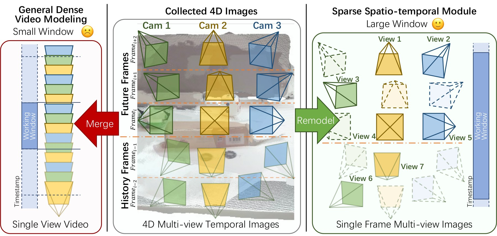
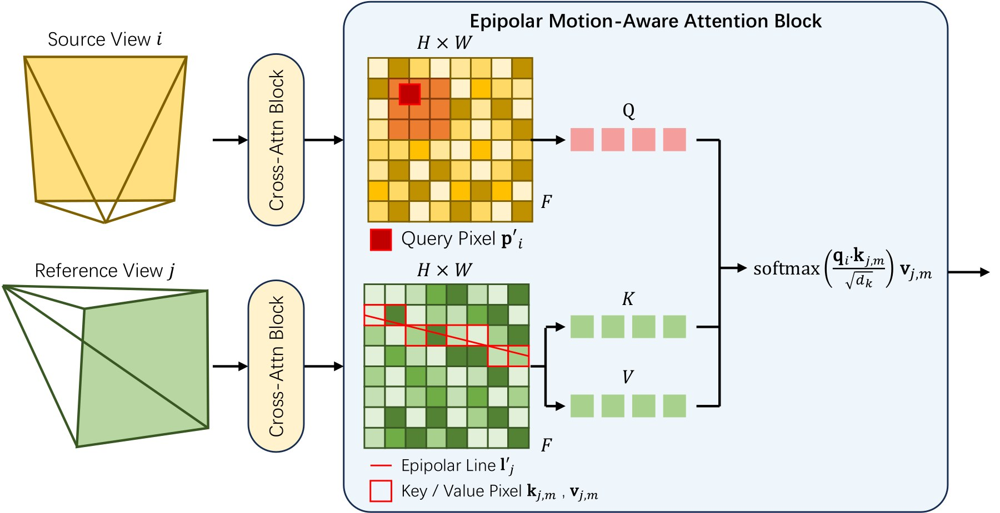
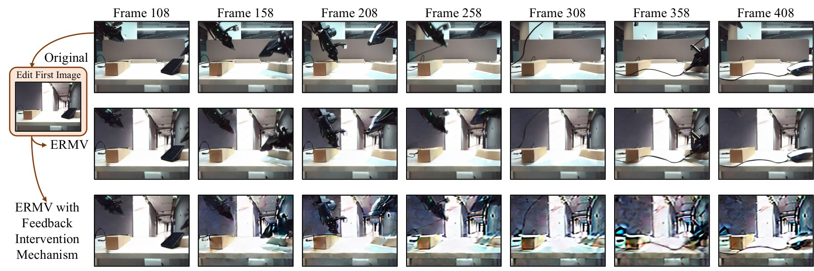
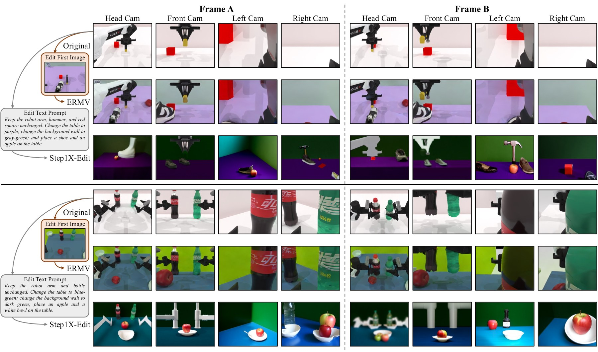
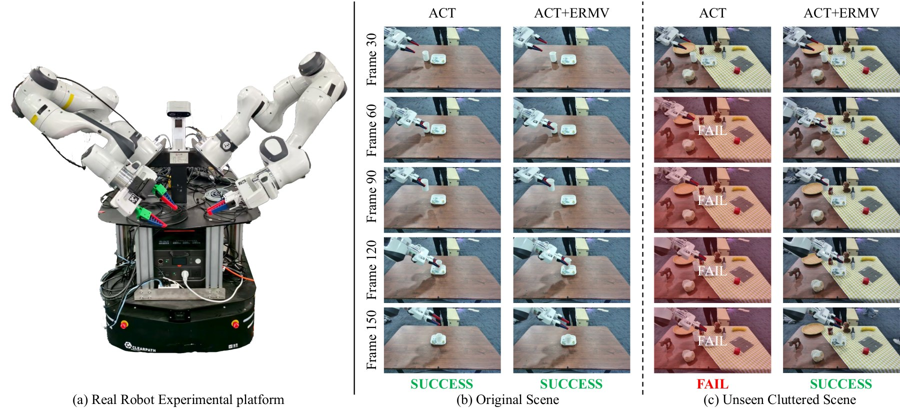

## At a glance

| Goal | Edit an entire multi-view robot trajectory from one globally informative edited frame |
|---|---|
| Conditions | Visual guide, robot state, camera pose, and temporal history |
| Key mechanisms | Sparse spatio-temporal modeling, epipolar motion-aware attention, and feedback intervention |
| Evaluation | RoboTwin simulation and dual-Panda real-robot policy training |
| Status | Preprint; under review at TCSVT |

Embodied learning needs variation: a policy should see different objects, textures, clutter, and camera configurations before deployment. Ordinary image editing can create an attractive new frame, but a robot demonstration is not a photo album. Every view and time step must describe the same intervention, and the edited scene must remain compatible with camera motion and robot state. A red mug that appears in one camera but becomes blue in another is not just a visual artifact—it creates contradictory supervision for the downstream policy.

ERMV addresses this data problem by propagating one guided intervention through a complete four-dimensional sequence: time × multiple camera views.

## The editing problem

A robot trajectory is written as $\mathcal{T}=(X_t,a_t)$, with multi-view observations $X_t$ and action or state information $a_t$. ERMV aims to construct

$$
\mathcal{T}'=(X'_t,a_t),
$$

while modeling the conditional distribution

$$
p\!\left(X'\mid X,C_{\mathrm{guide}},C_{\mathrm{state}},C_{\mathrm{history}}\right).
$$

The action sequence stays fixed; the visual world is edited coherently around it. A user first edits one frame that provides the global appearance change. A CLIP visual embedding turns that frame into $C_{\mathrm{guide}}$. The state condition includes camera pose, joint configuration $q$, camera-pose changes, and joint changes $\Delta q$, so the generator knows not only what the edit should look like but how the sensor and robot are moving.

The backbone is a latent diffusion model initialized from Stable Diffusion 2.1. With latent $z_t$, diffusion time $t$, and conditions $C$, the denoising objective is

$$
\mathcal{L}_{\mathrm{LDM}}
=\mathbb{E}_{z_t,t,\epsilon,C}
\left[\left\|\epsilon-G_\theta(z_t,t,C)\right\|_2^2\right].
$$

This standard objective becomes robot-specific through how the conditions and attention structure are constructed.

## Sparse spatio-temporal modeling

A dense video-volume attention layer grows rapidly with the number of frames and views. ERMV instead forms a sliding window of $L\times N$ tokens—$L$ time steps across $N$ cameras—and selects only $K\ll L\times N$ positions. Crucially, every sampled token keeps its original temporal and camera index. The model can therefore connect a past wrist view to a future external view without pretending they occupy adjacent positions.

Past and future are generated together rather than in isolated clips. In the reported setting, the condition includes four historical views over eight past frames and predicts six views over the next eight frames.

This design reduces memory by roughly 50% at the same window size in the reported comparison, while downstream average task success rises from 0.32 with dense modeling to 0.37 with sparse modeling.

## Epipolar motion-aware attention

Rigid multi-view geometry constrains where a scene point may appear in another camera, but a robot scene is not static: the arm, gripper, and manipulated object move. ERMV first predicts an offset for feature location $p_i$ from positional encoding and robot state,

$$
\Delta p_i=f_{\mathrm{blur}}\!\left(\phi(p_i),C_{\mathrm{state}}\right),
$$

then shifts the epipolar search according to that motion estimate before computing cross-view attention. The result is not a hard correspondence; it is a geometry-shaped attention neighborhood that remains flexible enough for articulated motion.

## Feedback that asks only for the missing correction

Long generated sequences can contain a locally inconsistent object even when most frames are correct. ERMV uses Qwen2.5-VL to compare original and generated sequences. When it finds a mismatch, it identifies the affected region and requests a targeted expert mask rather than discarding the whole sequence or silently accepting the error. This keeps the human intervention explicit and localized.

## Simulation: visual quality and downstream utility

Training uses batch size 4 and AdamW with learning rate $10^{-5}$ on one RTX 4090. The RoboTwin study covers 12 manipulation tasks. Against Step1X, ERMV reports a large image-quality gap:

| Method | SSIM $\uparrow$ | PSNR $\uparrow$ | LPIPS $\downarrow$ |
|---|---:|---:|---:|
| Step1X | 0.1916 | 6.31 | 0.6461 |
| ERMV | **0.8334** | **24.17** | **0.1043** |

Visual fidelity is only an intermediate measure, so the paper also trains robot policies on the augmented data. The original-data and ERMV-augmented success rates are:

| Setting | Policy | Original data | + ERMV | + Step1X |
|---|---|---:|---:|---:|
| Standard RoboTwin | RDT | 0.40 | **0.48** | 0.00 |
| Standard RoboTwin | Diffusion Policy | 0.37 | **0.41** | 0.00 |
| Unseen clutter | RDT | 0.19 | **0.37** | — |
| Unseen clutter | Diffusion Policy | 0.15 | **0.32** | — |

Each policy result in the clutter study is evaluated with 100 trials per task. The zero values for Step1X are preserved here because negative downstream evidence is part of the comparison: visually edited data are useful only if they remain coherent enough to train behavior.

## Real robot study

The physical setup uses ACT with a dual-Panda platform and two tasks. Across 100 trials per task, average success changes from 0.52 to 0.91 in the original environment and from 0.02 to 0.89 under unseen clutter after adding ERMV-generated data.

These numbers support the paper's central empirical claim: coherent trajectory editing can improve downstream policy robustness more than isolated frame quality would reveal.

## Scope and limitations

ERMV edits appearance around an existing action/state trajectory; it does not synthesize a new physically valid action sequence for an arbitrary changed task. The current representation does not explicitly model depth or a full 3D Gaussian scene, so difficult geometry and occlusion can still break consistency. The feedback loop may require manual masks, and its reliability depends on the multimodal verifier. Computation also remains heavier than simple image augmentation.

The paper discusses the framework as a possible ingredient for world modeling and sim-to-real data generation. Those are forward-looking capabilities, not yet blanket claims that every generated trajectory is physically executable. The demonstrated result is narrower and more useful: under the reported simulated and real setups, state-conditioned multi-view editing produces training data whose consistency can be measured through both pixels and robot success.
