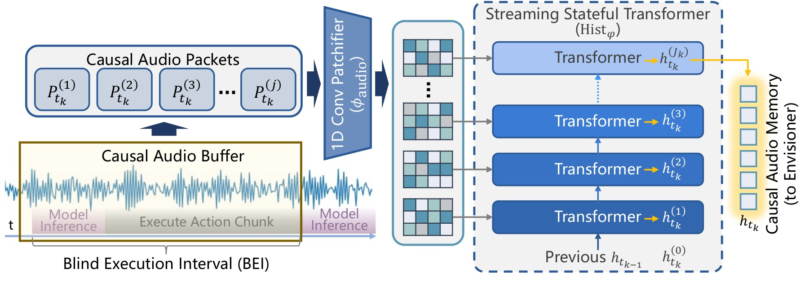
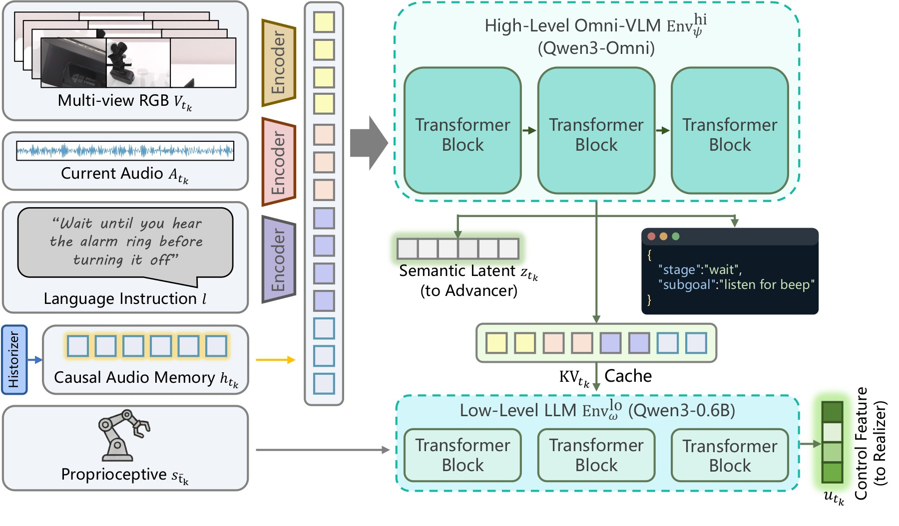
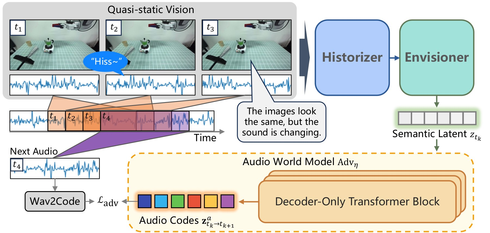
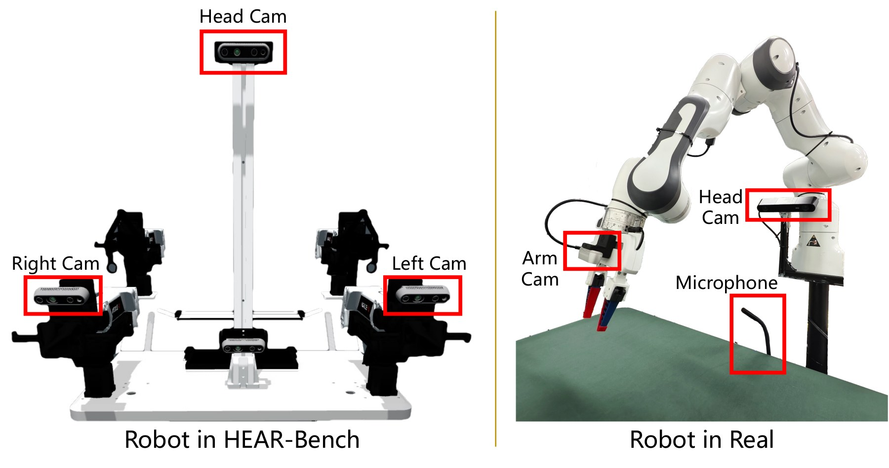
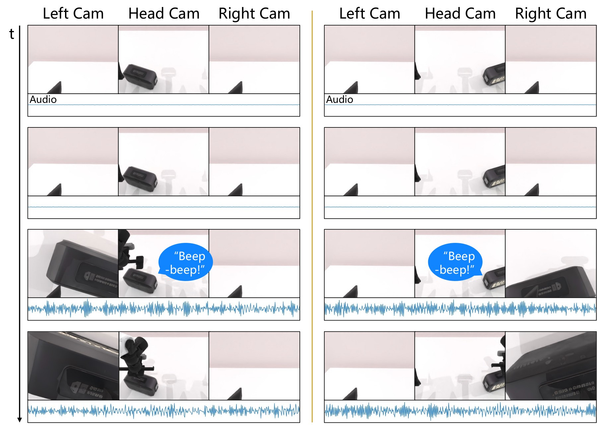
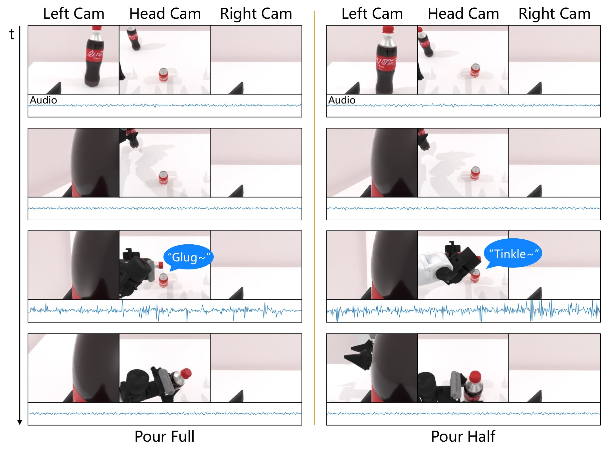
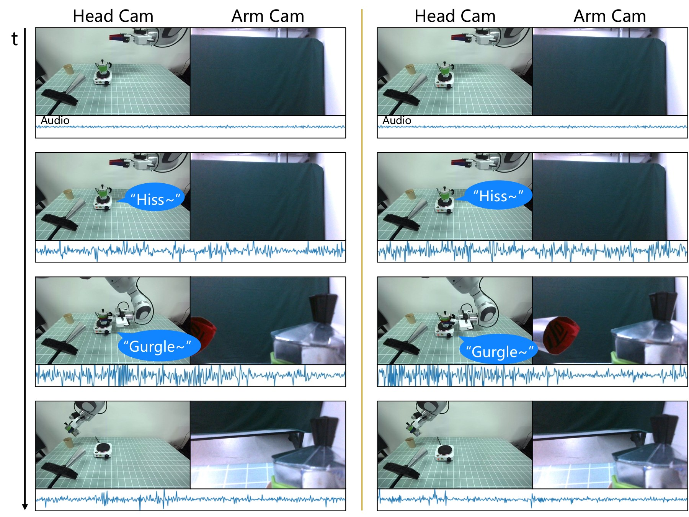
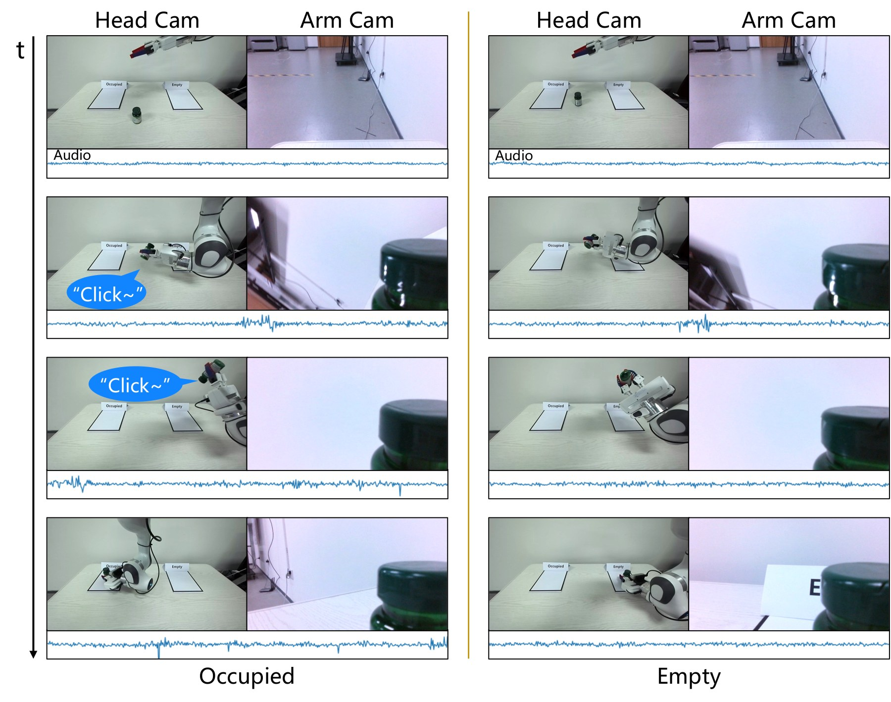
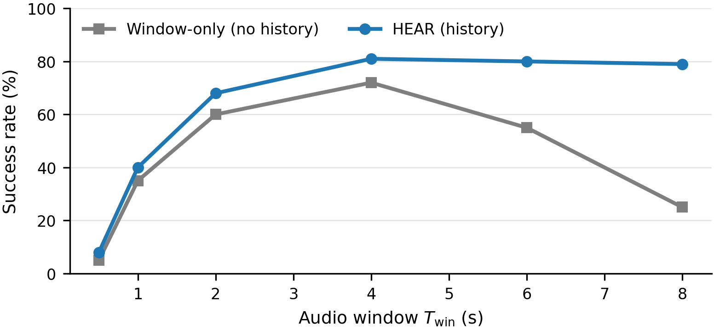
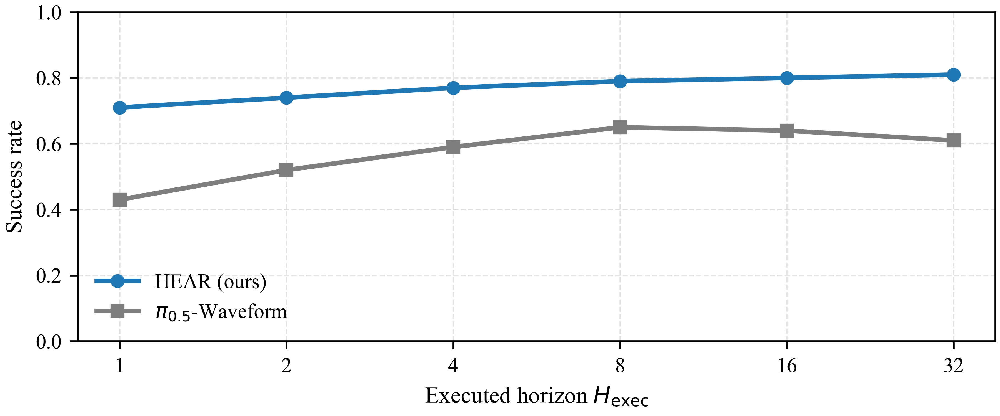

## At a glance

| Problem | Short sounds can begin and end while a robot is executing an open-loop action chunk |
|---|---|
| Paradigm | Vision–Sound–Language–Action (VSLA) in continuous physical time |
| Architecture | Historizer → Envisioner → Advancer → Realizer |
| Data | OpenX-Sound: about 120,000 sound-augmented pretraining episodes over 100 skills |
| Evaluation | HEAR-Bench: seven sound-causal tasks in simulation plus four real-robot tasks |

A microwave beep, a spoken interruption, or the first bubble of boiling water may last less than one robot action chunk. A vision-language-action policy that observes once, predicts a long action sequence, and looks again only after executing it can miss the event completely. Adding an audio waveform to the observation vector does not solve this timing mismatch: the sound must remain causally available after the waveform itself has disappeared.

HEAR begins from this systems problem and formalizes a Vision–Sound–Language–Action paradigm in continuous physical time.

## Why chunked control creates an evidence gap

Let robot decisions occur at control times $t_k$, while audio arrives at 16 kHz and motor control runs at about 30 Hz. A causal audio window with system delay $\tau_{\mathrm{sys}}$ can be written as

$$
\mathcal{A}_k=
\left[a\!\left(\bar t_k-W,\bar t_k\right)\right],
\qquad
\bar t_k=t_k-\tau_{\mathrm{sys}},
$$

and the multimodal observation is

$$
o_k=\left(I_k^{1:V},\mathcal{A}_k,\ell,q_k\right),
$$

with multi-view RGB images, a language instruction $\ell$, and robot state $q_k$. Suppose the policy predicts a horizon $H$, executes $H_{\mathrm{exec}}$ actions open loop, and observes again after decision interval $\Delta=H_{\mathrm{exec}}$. The effective evidence gap is approximately

$$
G=\Delta+\tau_{\mathrm{sys}}.
$$

If a sound begins and ends inside that gap and the next causal window no longer covers it, the raw observation at $t_{k+1}$ contains no trace of the event. No larger transformer at that instant can reason from evidence it never receives. A persistent causal memory state $h_k$ is therefore an architectural requirement, not an optional feature.

HEAR also distinguishes ordinary geometric success from **timed success**. If $t_{\mathrm{snd}}$ is the event time and $t_{\mathrm{goal}}$ the completion time,

$$
S_{\mathrm{timed}}=\mathbf{1}\!\left[t_{\mathrm{snd}}\le t_{\mathrm{goal}}\le T\right].
$$

Completing the physical goal too early can be a failure—for example, removing an object before the alarm authorizes the action.

## Four modules with different temporal roles

### 1. Historizer: preserve transient evidence

The Historizer consumes causal packets of 640 audio samples, or 40 ms at 16 kHz. A stateful streaming Transformer with four layers, width 256, four attention heads, and 16 memory tokens updates a compact recurrent state. The memory is designed to span the decision gaps in which short events would otherwise vanish.

This avoids a common temporal-aliasing failure: two current visual observations may appear nearly identical, $o_{t_k}\approx o_{t_{k'}}$, even though one follows a beep and the other does not. The correct actions differ, so the hidden history must disambiguate them.

### 2. Envisioner: turn memory into task stage

The Envisioner performs multimodal reasoning over vision, remembered audio, language, and robot state. A high-level Qwen3-Omni model derives semantic context $z$; a Qwen3-0.6B low-level component maintains a structured stage representation with KV caching and emits a constrained JSON state. The hierarchy separates expensive semantic interpretation from the frequent task-stage updates needed by control.

### 3. Advancer: predict what should be heard next

The Advancer is a four-layer, width-512, eight-head Transformer trained to predict near-future Mimi audio codes using cross-entropy. It is used during training, not as another runtime sensor. Forecasting future sound forces the shared representation to encode temporal progress: pouring, boiling, alarms, and spoken exchanges have different acoustic futures even when a still frame looks similar.

### 4. Realizer: generate smooth actions

The Realizer maps the fused representation to an action trajectory using conditional flow matching. At inference, the reported implementation integrates the learned vector field with eight Euler steps. Its training objective is combined with the audio-prediction and stage-text terms:

$$
\mathcal{L}=
\mathcal{L}_{\mathrm{flow}}
+0.1\mathcal{L}_{\mathrm{adv}}
+0.05\mathcal{L}_{\mathrm{text}}.
$$

The four modules therefore answer four different questions: what sound must be remembered, what it means now, what temporal process it predicts, and what continuous action should follow.

## OpenX-Sound: pretraining sound, not fabricating evaluation

OpenX-Sound contains approximately 120,000 episodes spanning 100 skills and embodiments from 7 to 120 kg. The original Open X-Embodiment videos did not provide synchronized task audio, so HEAR synthesizes sound from the original visual sequences for **pretraining only**. Real and simulated benchmark evaluation is kept separate.

A manual synchronization audit samples 500 episodes, each checked by two annotators; 98.7% are judged synchronized within 100 ms. This is a quality-control result for the constructed resource, not evidence that synthetic audio perfectly matches real microphones.

## HEAR-Bench: tasks where sound changes the correct action

The simulated benchmark has seven tasks in four causal categories:

- **Alarms:** Alarm Clock and Microwave require action after an acoustic event.
- **Speech:** Check Yes and Interrupt require understanding a spoken response or stop request.
- **Processes:** Pour Water and Boil Water require tracking an evolving acoustic process.
- **Materials:** Check Materials uses sound to distinguish object properties.

Event timing is randomized, so a policy cannot succeed reliably by memorizing a fixed delay. Training uses 200,000 pretraining steps and 50,000 steps per simulated task; real tasks use 30,000 steps each. The reported setup uses batch size 256 on two RTX 5090 GPUs.

## Simulation results: exact per-task denominators

Every simulated task is evaluated with 100 trials. Results are success fractions, in the order Alarm Clock, Check Yes, Check Materials, Pour Water, Boil Water, Microwave, and Interrupt:

| Method | Alarm | Yes | Material | Pour | Boil | Microwave | Interrupt | Avg. |
|---|---:|---:|---:|---:|---:|---:|---:|---:|
| Best reported VLA baseline (π0.5-Waveform) | — | — | — | — | — | — | — | 0.61 |
| HEAR | **0.91** | **0.89** | **0.83** | **0.51** | **0.81** | **0.85** | **0.88** | **0.81** |

The 0.51 Pour Water result is worth retaining beside the average: it prevents the overall score from hiding the hardest simulated task.

## Real-robot results

Four physical tasks are evaluated with 100 trials each:

| Method | Moka Coffee | Answer Phone | Shake Bottle | Real Alarm | Avg. |
|---|---:|---:|---:|---:|---:|
| Best reported VLA baseline (π0.5-Waveform) | — | — | — | — | 0.39 |
| HEAR | 0.18 | 0.15 | **0.88** | **0.96** | **0.54** |

HEAR is strong on the shorter causal tasks, but the absolute success rates of 0.18 and 0.15 on Moka Coffee and Answer Phone show that long-horizon real manipulation remains unresolved. The page keeps those values visible rather than presenting only the 0.54 average.

## Ablations and timing studies

| Variant | Simulated average success |
|---|---:|
| Full HEAR | **0.81** |
| Without pretraining | 0.69 |
| Without Historizer | 0.57 |
| Replace Historizer with GRU | 0.67 |
| Replace it with EMA/pooling | 0.62 |
| Without Advancer | 0.73 |
| Without stage representation | 0.77 |
| Without low-level Envisioner | 0.75 |
| Regression action head | 0.70 |

The Historizer causes the largest ablation drop, directly supporting the evidence-gap argument. The Advancer also changes behavior: low-motion action chunks occupy 0.15 of outputs for the full model, versus 0.33 without the Advancer and 0.38 with a regression head. Future-sound prediction helps the policy represent progress instead of hesitating.

Replanning only at the first chunk yields 0.71 average success, replanning halfway yields 0.80, and the default schedule yields 0.81. Window and action-chunk sweeps show the expected trade-off: memory must cover relevant events, while excessively long open-loop execution widens the evidence gap.

Reported false-trigger and missed-detection rates for HEAR are 0.02 and 0.04, respectively.

## Limits and research significance

Synthetic sound supports pretraining but leaves a real-to-synthetic acoustic domain gap. Microphone placement, echo, motor noise, language variation, and end-to-end latency remain deployment concerns. The difficult real tasks show that remembering sound is necessary but not sufficient for long-horizon manipulation; robust recovery and broader physical experience are still needed.

HEAR's main contribution is a causal systems formulation. Sound is not appended as one more static modality. Its sampling rate, transient duration, memory horizon, prediction target, and relationship to the action chunk are all modeled explicitly. The experiments show that this organization improves sound-causal behavior, while the per-task results clearly mark where the system still fails.
