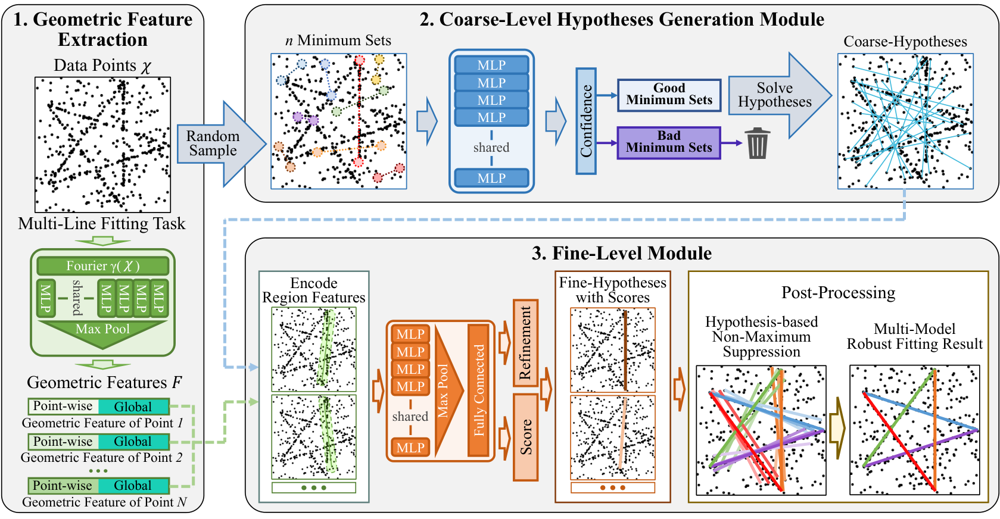
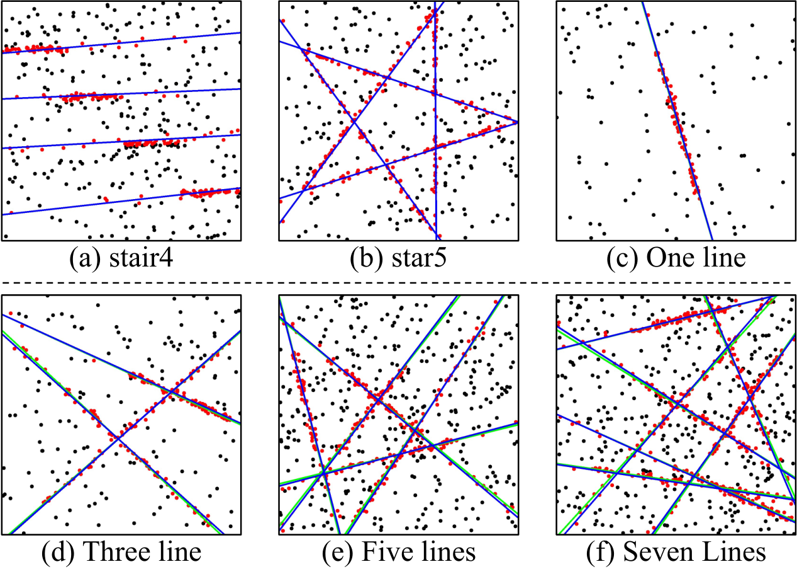
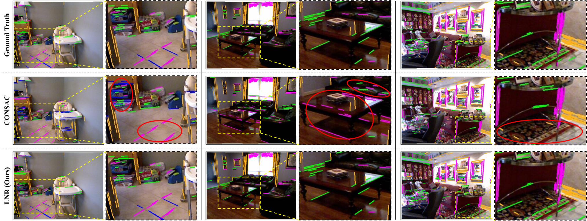

## 一页速览

| 问题 | LNR 的回答 |
|---|---|
| 拟合对象是什么？ | 同一组含噪观测中的多个几何实例 |
| 学习什么？ | 数据点几何特征、最小集置信度、假设细化与评分 |
| 哪些部分保持经典形式？ | 随机采样、任务相关的最小求解器和最终几何模型 |
| 如何处理模型重叠？ | 为每个假设构造独立邻域；同一个点可同时为多个邻域提供证据 |
| 在哪里评测？ | 多直线拟合、消失点估计、双视图平面分割和双视图运动估计 |

许多视觉问题需要同时恢复多个模型：点集中的多条直线、图像中的多个消失方向，或双视图对应中的多个平面和运动实例。难点不只在外点。一个点可能靠近多个模型，也可能同时为多个模型提供证据；因此“拟合一个模型、移除其内点、再继续”的贪心流程容易在逐步推进时丢失结构。

Learning Neighbor Regions（LNR）学习哪些最小集值得被求解，以及哪些局部邻域能够支持一个假设。任务专用的几何求解器将筛选后的集合转换为候选模型。

## 在昂贵求解之前完成粗筛

给定含噪观测 $\chi=\{x_i\}_{i=1}^N$，LNR 先为每个点构造同时包含局部证据和全局上下文的特征。论文采用 Fourier 特征映射、共享 MLP 与最大池化得到该几何表征。

随后，随机采样生成大量最小集。粗层模块不再逐一求解它们，而是根据集合内点的特征对每个候选打分，只保留最有希望的一小部分，再交给任务相关的求解器 $S$：

$$
H_{\mathrm{coarse}}=\{S(M_j)\mid M_j\in\mathbb{M}_{\mathrm{good}}\}.
$$

这种分工对于多模型问题尤其重要：随机采样仍然提供广泛覆盖，学习到的筛选则避免显然无效的候选消耗后续细化预算。

## 用邻域表征显式处理重叠

一个假设是否可靠，不能只看其参数。LNR 针对每个粗假设收集邻域数据点的特征，并拼接这些点相对该假设的残差。细化头预测参数增量，评分头估计假设质量；两者对每个候选假设独立工作。

这种邻域表征允许一个观测在模型重叠时同时贡献给多个假设。训练只依赖数据点特征和学习头的输出，不需要穿过离散采样或任务求解器反向传播。推理阶段再由基于假设的非极大值抑制选择最终复合模型，并自动决定保留的模型数目。

## 从特征到监督细化

每个点拼接 128 维局部特征和 128 维全局特征，粗筛网络同时接收原始坐标。邻域随任务定义：直线使用欧氏距离，消失点使用方向距离，平面使用重投影误差，运动使用归一化极线约束。点数不足的邻域以零填充，便于批处理。

训练依据候选与真值模型的相似度监督最小集置信度和假设评分，并以 Smooth L1 损失学习参数细化。测试时抑制几何上重复的假设。

## 拟合不同类型的结构

同一组处理阶段可以适配多类几何问题，每类任务使用相应的残差与求解器。

| 场景 | 拟合目标 | 论文报告的评价 |
|---|---|---|
| 多直线拟合 | 多条带噪二维直线 | 1–10 条直线场景上的 $0.5^\circ$ AUC |
| 消失点估计 | 图像中多个线方向 | NYU-VP、YUD+ 和 YUD 上的 $5^\circ$、$10^\circ$ AUC |
| 双视图平面 | 多个平面对应组 | AdelaideRMF 上的平均误分类率 |
| 双视图运动 | 对应中的多个运动实例 | AdelaideRMF 上的平均误分类率 |

论文在这四项任务上报告了领先结果。消失点实验还只在 NYU-VP 上训练，并直接在 YUD+ 和 YUD 上测试，从而将跨数据集迁移与同分布拟合区分开来。

## 消融实验检验了什么

消融实验按设计链条逐项检验，而非把网络当作一个不可解释的整体：比较由粗到细处理与直接预测假设、学习评分与简单内点计数、随机采样与替代性学习采样、Fourier 特征映射，以及神经网络细化与最小二乘细化。论文的分析表明，完整模型的效果来自早期筛选和邻域感知细层评分的结合；更强的采样器可以提升精度，但也会带来额外运行时间。

LNR 也与本站较早的 RLSAC 工作形成互补：RLSAC 通过试验反馈学习单模型一致性估计中的顺序采样策略；LNR 面向同时存在且可能重叠的多个实例，通过评分广泛的假设池，并在每个候选的邻域内完成细化。
