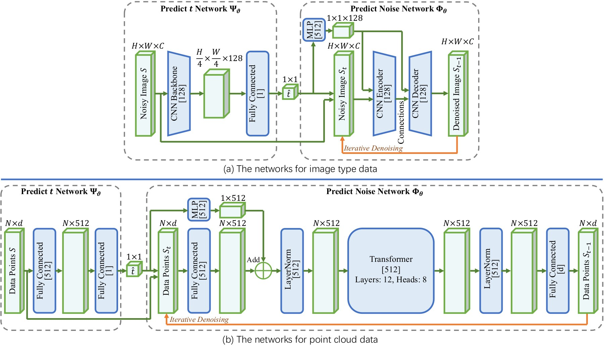
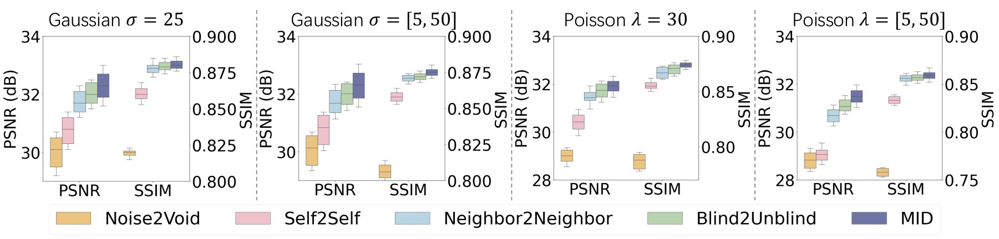
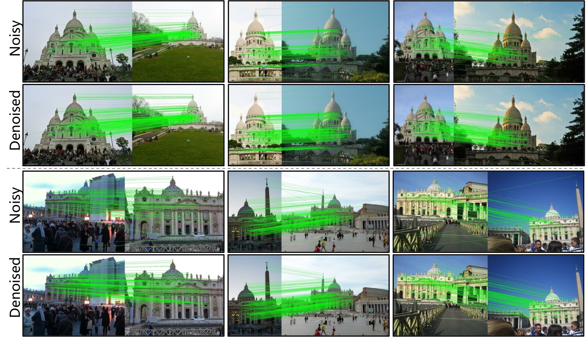
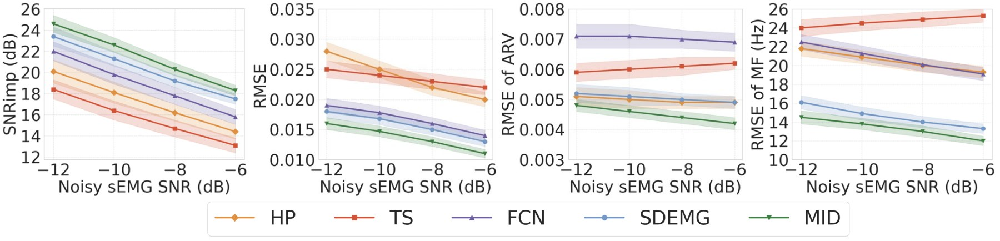
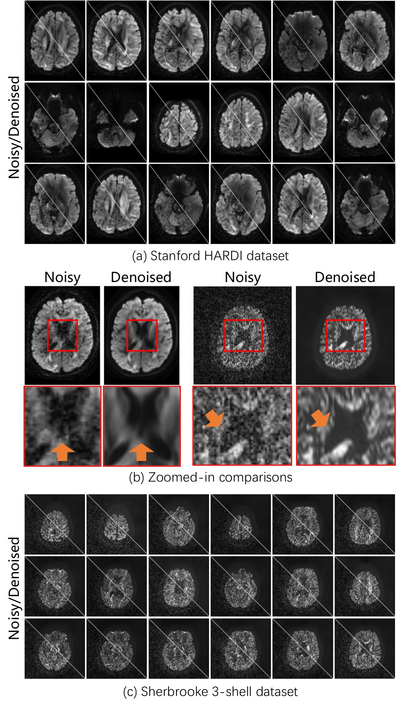
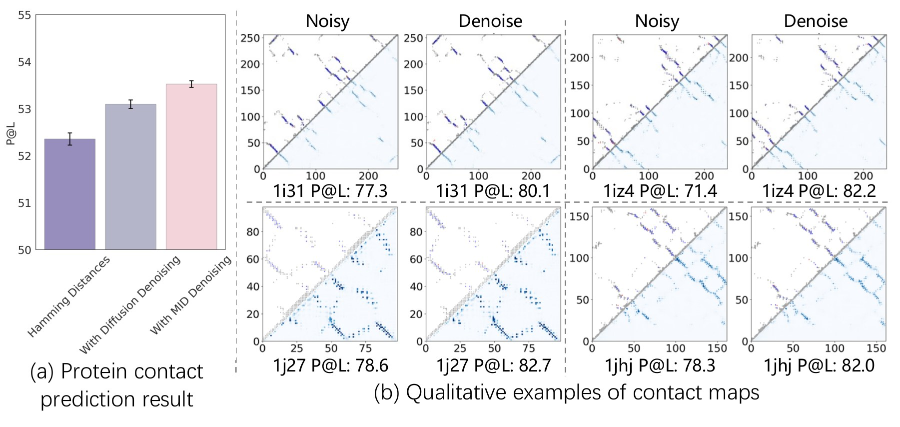
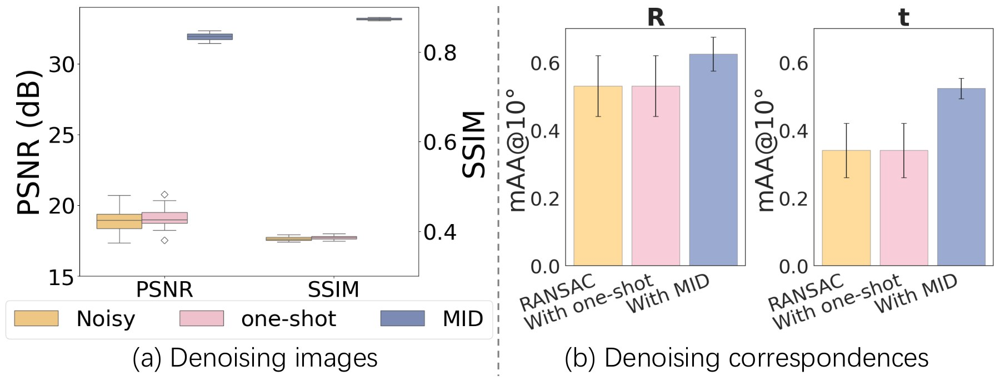

## At a glance

| Question | MID's answer |
|---|---|
| Can denoising be learned without paired clean targets? | Treat each noisy observation as a state on a synthetically extended corruption path |
| How is nonlinear corruption reversed? | Estimate the current noise stage, then remove one learned local residual repeatedly |
| Is the architecture modality specific? | No—the formulation is instantiated with CNNs or Transformers according to the data structure |
| What is tested? | Natural images, robust geometry, sEMG/ECG, MRI, and protein sequence representations |

Many denoisers quietly assume that clean targets exist. In scientific and embodied data, that assumption can be the hardest part of the problem: a second MRI acquisition is not perfectly aligned, a clean biosignal may be unavailable, and a geometric correspondence set has no single continuous “clean image” counterpart. Real noise can also be nonlinear and heterogeneous, so asking one network to jump directly from an unknown corruption level to a clean output is brittle.

MID reframes restoration as navigation along a learned corruption trajectory. It does not require a clean endpoint during training; it learns local reversal steps from noisy observations that can be corrupted further in controlled ways.

## A noisy observation is an intermediate state

Let $s=s_0$ be the observed sample. A controllable noising operator creates a sequence

$$
s_t=\psi_{\mathrm{Noising}}(s,\epsilon_t,t),
$$

where larger $t$ corresponds to additional corruption. Even if the global trajectory is nonlinear, two neighboring states admit a local first-order approximation,

$$
s_t\approx s_{t-1}+\Delta s_{t-1}.
$$

This is the key move. Instead of learning an unavailable map from noisy observation to pristine truth, the model learns how much corruption is present and how to undo one nearby increment.

Two networks divide those responsibilities:

- $\Psi$ predicts the current corruption stage $\hat t=\Psi(s_t)$.
- $\Phi$ predicts the local residual/noise conditioned on the sample and stage.

Inference then iterates

$$
\hat t=\Psi(s_t),
\qquad
s_{t-1}=s_t-\Phi(s_t,\hat t),
$$

until the estimated stage approaches zero. This makes the number of restoration steps data dependent: a mildly corrupted sample need not follow the same path as an extreme one.

## Self-supervised objectives and architectures

The model receives supervision because the additional corruption process is known: it can regress the synthetic stage and residual even though the original clean sample is unknown. Training combines mean-squared losses for stage and noise prediction; point-classification tasks add a binary cross-entropy term. The total objective is the sum of the active components.

Images and MRI use convolutional networks. Point sets, line segments, one-dimensional signals, and amino-acid representations use Transformer variants, allowing interactions without forcing every modality into an image grid. Across the reported implementations, training uses AdamW with learning rate $10^{-4}$, weight decay 0.01, batch size 8, 150 epochs, and an RTX 8000 GPU.

The point is not that one fixed network processes everything. The common object is the *learning dynamics*: estimate location on a corruption path, take a local reverse step, inspect the new state, and repeat.

## Case study 1: natural-image denoising

The image model is trained on resized $256\times256$ ILSVRC 2012 images and evaluated on Kodak with Gaussian and Poisson corruption. Additional protocols use BSD300/BSD400 for training and BSD68 for testing. PSNR and SSIM quantify fidelity, while qualitative examples show texture recovery and edge preservation.

The paper reports consistent improvement over the compared self-supervised and supervised alternatives in its tables. Because performance depends on the dataset/noise configuration, this page does not collapse the several rows into one invented headline number.

## Case study 2: robust geometric estimation

For multi-line fitting, scenes contain 1–10 lines, with 12,000 scenes for each line-count setting: 10,000 for training and 2,000 for testing. Every line has 40–100 points, Gaussian perturbation is sampled around 0.007–0.008, and 40–60% of observations are outliers. Accuracy is measured as AUC at $0.5^\circ$. MID improves the reported result by as much as 36.8% across these configurations.

For two-view correspondence denoising, 12 RANSAC-tutorial scenes each contribute 100,000 training pairs and two held-out scenes each provide 4,950 test pairs. Fundamental- and essential-matrix estimation are evaluated using mAA at $10^\circ$; the reported gains reach 53.7%. The framework is also tested on vanishing-point estimation with NYU-VP (1,224 train, 225 test) using LSD line segments and AUC at $5^\circ$, plus cross-dataset evaluation on YUD/YUD+.

Here denoising does not mean smoothing coordinates indiscriminately. It means recovering a structured signal—such as mutually consistent matches—from a contaminated set.

## Case study 3: physiological signals

The biosignal study uses sEMG from NINAPro DB2 and ECG from the PhysioNet Noise Stress Test Database. Subjects, channels, and movements used for testing are separated from training. Training corruption spans SNR from $-15$ to $-5$ dB, while test levels span $-12$ to $-6$ dB. Metrics include SNR improvement, RMSE, average rectified value, and mean frequency.

Across the reported comparisons, MID outperforms classical filters, FCN, and SDEMG baselines with statistical significance at $p<0.05$. The held-out subject/channel/movement design is essential: it tests whether the reverse process generalizes beyond memorizing one person's waveform.

## Case study 4: MRI without a clean reference

Experiments use Stanford HARDI ($106\times81\times76\times150$, $b=2000$) and Sherbrooke ($128\times128\times64\times193$, $b=1000$), with slices resized to 256 pixels. MID is compared with DDM2, Noise2Noise, Patch2Self, and Deep Image Prior.

The paper reports significantly stronger relative SNR/CNR proxy measures ($p<0.05$). These are no-reference proxies rather than accuracy against a known clean anatomy; that distinction is important when interpreting biomedical results.

## Case study 5: protein representations

The final study applies iterative denoising to multiple-sequence-alignment representations from UniClust30 with an MSA Transformer. Long-range contact prediction is measured by Top-$L$ precision. MID improves the reported average by 2.2%, with $p<0.05$.

This experiment is less about the absolute size of one gain than about the scope of the formulation: the corrupted object may be a pixel grid, a geometric set, a waveform, or a biological sequence representation.

## Why iteration matters

A one-shot variant tries to remove the full estimated corruption in a single pass. The ablation shows that this direct jump is less reliable than repeated local updates, particularly for nonlinear or severe noise. Stage prediction is also necessary: without it, the residual network cannot adapt the magnitude of its correction to the current state.

## Limits and interpretation

MID still requires a designed additional-noise process whose variations are informative about the real corruption. If the observed signal has already lost its defining structure, no self-supervised procedure can reconstruct evidence that is absent. Iterative inference costs more than a single forward pass, and different modalities still require suitable architectures, corruption operators, and evaluation protocols.

The defensible conclusion is therefore not “one universal denoiser solves every modality.” It is that a common self-supervised *iterative formulation* can be instantiated across very different data structures, and that local stage-aware reversal is more flexible than assuming one fixed global corruption map.
