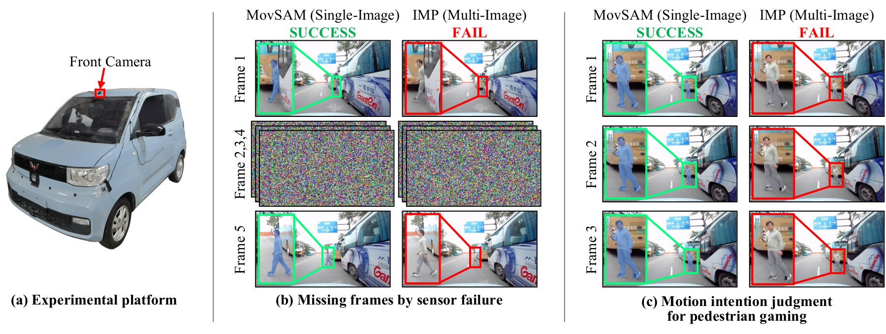
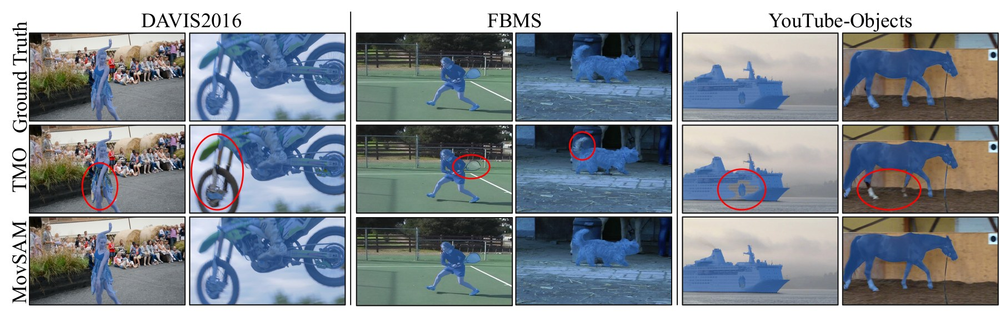
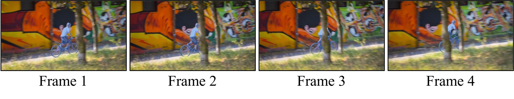
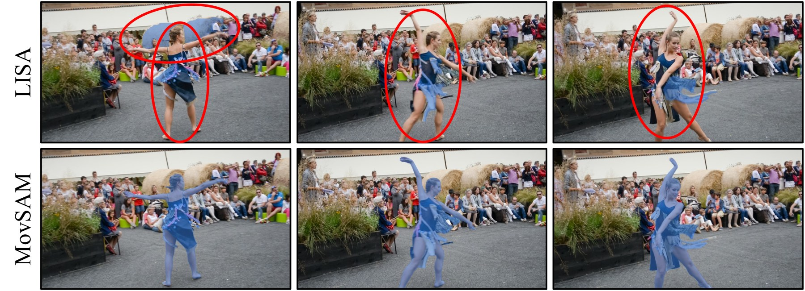

## 一页速览

| 设定 | 设计选择 |
|---|---|
| 输入 | 单张 RGB 图像，不使用光流或相邻帧 |
| 推理 | 多模态大模型判断可能运动的物体，并生成文本提示 |
| 分割 | 融合 SAM2、BEiT-3 视觉语言特征与可学习聚合器 |
| 细化 | 最多五轮“图像—当前结果—再推理”的深度思考闭环 |

“运动”通常需要跨时间观察。如果由于丢包、遮挡或相机异常只剩一帧，仅凭外观不可能严格证明物理运动。但人仍能作出有用判断：道路上的骑行者、正在奔跑的行人，或顺着车流方向出现的车辆，都带有静态前景检测难以利用的语义和上下文。MovSAM 把单图像运动物体分割定义成一个**时间证据缺失时的推理问题**。

## 先推理，再分割

给定图像 $I$，多模态大模型 $\Phi$ 先产生语义描述或物体提示 $T$：

$$
T=\Phi(I).
$$

具体实现使用 Llama-3.2-11B-Vision：它观察完整场景，逐步分析哪些实体更可能运动，再把结论写成文本。这个提示并不是最终掩码，而是传给视觉分割模块的显式语义先验，从而把“场景推理”和“像素预测”两个职责分开。

SAM2 提供图像与掩码表征，BEiT-3 提供对齐的视觉语言特征。特征聚合模块由五层卷积和一层全连接组成，将全局上下文压缩为 512 维向量，再与提示条件表征融合。训练时冻结 SAM 图像编码器，优化视觉语言模型、聚合器与 SAM 的其余模块。论文报告的初始化模型为 SAM ViT-Huge 和 BEiT-3 Large。

## 把“深度思考”落到一个有限闭环

一次语言判断可能选错物体，也可能漏掉歧义目标。MovSAM 会把当前分割结果重新放入多模态上下文，请模型再次检查。每一轮都可修改提示并更新掩码；结果稳定或达到五轮后停止。因此，这里的“深度思考”指一个有上限的“观察—推理—分割—复查”循环，而不是声称语言模型可以凭空恢复真实运动物理。

## 学习目标与评价方式

对像素预测 $p_i$ 和标签 $y_i$，训练联合 Dice 损失与二元交叉熵：

$$
\mathcal{L}_{\mathrm{Dice}}
=1-\frac{2\sum_i p_i y_i}{\sum_i p_i+\sum_i y_i},
$$

$$
\mathcal{L}_{\mathrm{BCE}}
=-\frac{1}{N}\sum_i\left[y_i\log p_i+(1-y_i)\log(1-p_i)\right],
\qquad
\mathcal{L}=\mathcal{L}_{\mathrm{Dice}}+\mathcal{L}_{\mathrm{BCE}}.
$$

评价沿用运动物体分割协议。区域相似度采用交并比

$$
\mathcal{J}=\frac{|M\cap G|}{|M\cup G|},
$$

边界质量采用 $\mathcal{F}=2PR/(P+R)$，二者均值 $\mathcal{J}\&\mathcal{F}$ 同时概括区域和轮廓质量。

训练数据来自人工筛选后的 DAVIS 2016、FBMS 与 SegTrackV2，共训练 100 个 epoch，使用四张 RTX 8000。人工筛选不是无关细节：单帧没有直接运动测量，因此标签必须避免把“语义上像在动、实际上静止”的对象当成正确监督。

## 基准实验

| 数据集 | 指标 | MovSAM | 对比方法中的最好结果 |
|---|---|---:|---:|
| DAVIS 2016 | $\mathcal{J}\&\mathcal{F}$ | **92.5** | 86.7（FlowP/FlowI） |
| DAVIS 2016 | $\mathcal{J}$ / $\mathcal{F}$ | **90.4 / 94.6** | 87.7 / 85.6（FlowP/FlowI） |
| FBMS | $\mathcal{J}$ | **83.9** | 82.8 |
| YouTube Objects | 平均 $\mathcal{J}$ | **79.0** | 75.1 |

DAVIS 对比很有代表性：尽管部分对手使用时间输入，单图像 MovSAM 的论文报告分割分数更高。定性序列还展示了局部遮挡和细边界条件下保持掩码连贯的情况。

论文报告的单图推理时间约为 0.3 秒。它显然慢于轻量前馈分割器，但更适合作为恢复流程或后备感知模块，而不是高频跟踪器。

## 每个模块贡献了什么

| DAVIS 2016 消融设置 | $\mathcal{J}\&\mathcal{F}$ | $\mathcal{J}$ | $\mathcal{F}$ |
|---|---:|---:|---:|
| 去掉特征聚合 | 90.5 | 87.9 | 93.1 |
| 去掉深度思考细化 | 92.0 | 89.7 | 94.2 |
| 完整 MovSAM | **92.5** | **90.4** | **94.6** |

特征聚合带来的增益更大，迭代推理则提供较小但一致的提升。另一组比较说明了任务适配的重要性：未微调的 LISA 总分为 22.8，微调后为 70.1，MovSAM 为 92.5。

## 结论边界

MovSAM 面向的是时间测量缺失的场景，例如掉帧后的孤立观测或语义安全检查。它依据物体类别、姿态、交互与场景上下文推断“可能在运动”。这种推断有用，却不等同于测量速度；怠速车辆和动作定格中的行人，在单帧中仍然存在本质歧义。

局限也由此而来：结果依赖多模态模型的推理质量；迭代闭环增加延迟，也可能继承语言模型偏差；罕见物体和异常上下文会诱发自信但错误的语义判断。在完整机器人系统中，更准确的定位是：MovSAM 是时间几何线索的鲁棒语义补充，而不是“运动感知不再需要时间”的证据。
