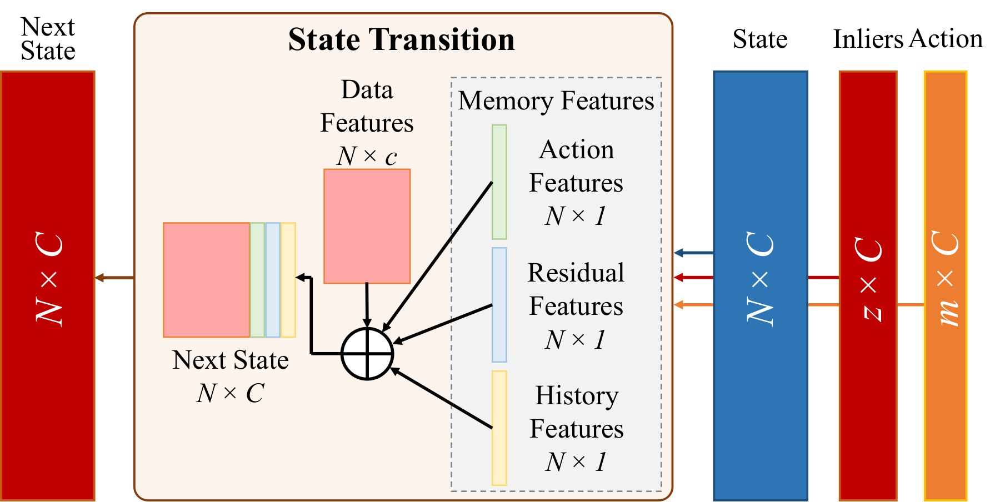
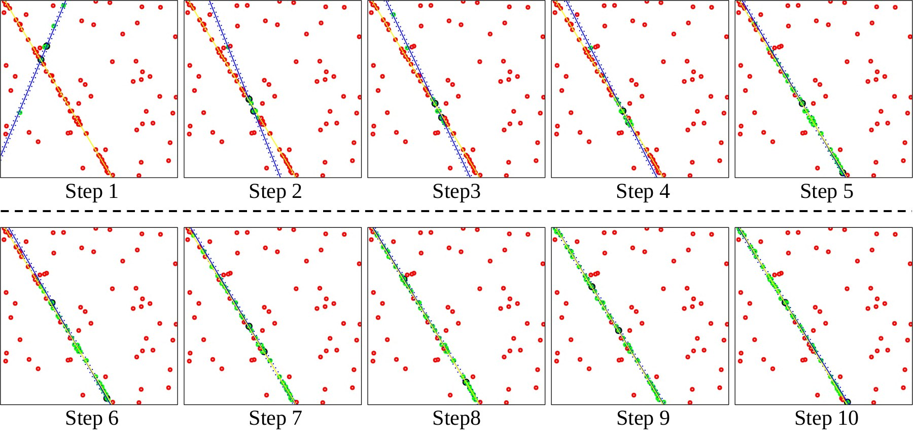
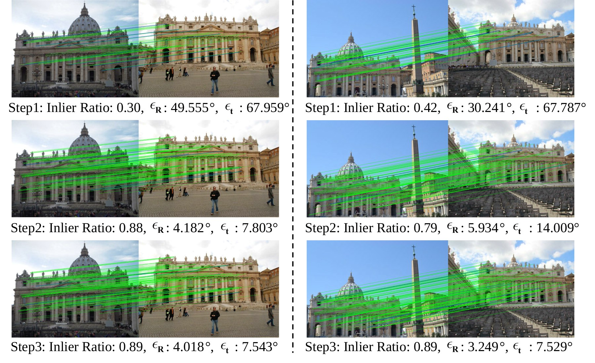
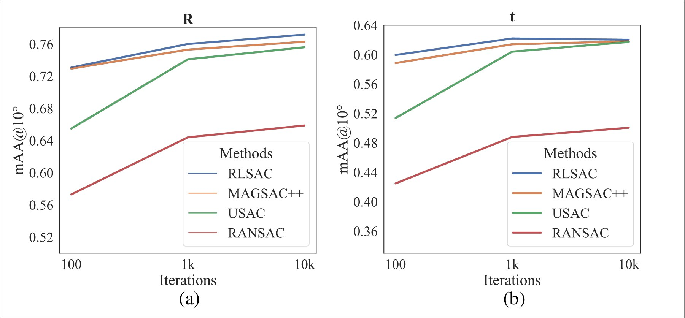

## At a glance

| Question | RLSAC's answer |
|---|---|
| What should be learned? | The sampling policy; the geometric solver remains fixed |
| What supervision is required? | No labels for the “correct” minimum set; hypothesis quality supplies the reward |
| What enters the policy state? | Observation features, the current sampling action, residuals, and the history of tested points |
| Where is it evaluated? | Synthetic line fitting and real two-view fundamental-matrix estimation |

Robust estimation often has an unusual computational shape: the solver may be well understood, yet its success depends on selecting a tiny all-inlier subset from a heavily contaminated observation set. RANSAC handles this by drawing minimum sets repeatedly, fitting a hypothesis from each set, and retaining the best consensus. Uniform sampling is dependable, but it does not learn from the evidence accumulated during that search. RLSAC asks whether the sequence of trials can itself become an adaptive decision process.

## From repeated trials to a Markov decision process

Let $\chi$ be the observations and $\mathcal{M}_j$ a sampled minimum set. A conventional consensus loop constructs hypotheses

$$
\mathcal{H}=\{S(\mathcal{M}_j)\}_{j=1}^{J},
\qquad
h_{\mathrm{best}}=\arg\max_{h\in\mathcal{H}} f(h,\chi),
$$

where $S$ is a task-specific solver and $f$ evaluates a hypothesis by its consensus. RLSAC leaves both interfaces intact. It replaces only the proposal rule: the next action is drawn from a learned policy,

$$
a_{t+1}\sim\pi_\phi(a_{t+1}\mid s_t),
$$

and the reward is the inlier ratio obtained after solving and scoring the proposed set. This reward evaluates the *joint geometric consequence* of the selected observations, allowing training directly from downstream consensus without pointwise inlier annotations.

The state contains four complementary signals:

1. **Data features** describe each observation. Their representation is task dependent—for example, point coordinates for line fitting and coordinates, matching scores, and descriptors for correspondence estimation.
2. **Action features** mark whether a point belongs to the currently sampled set using $+1/-1$ indicators.
3. **Residual features** record how well every observation agrees with the hypothesis produced by that action.
4. **Historical features** count how often each point has already been selected, preventing the policy from behaving as if every trial were the first.

Together these signals turn “fit, score, discard” into a state transition. A good hypothesis provides positive evidence about its selected points and nearby structure; a poor one still teaches the sampler which combinations consumed budget without improving consensus.

## Policy and training

The policy uses an EdgeConv/DGCNN-style graph network, so pointwise evidence can interact with local neighborhoods. The network outputs a distribution over observations, from which a non-duplicate minimum set is drawn. The environment then invokes the unchanged geometric solver and updates residual and history features. A discrete Soft Actor-Critic objective trains the policy off-policy, balancing reward and exploration.

Training runs for 100 epochs. An episode stops when the inlier count is unchanged for $\kappa=2$ transitions, when the best inlier ratio has not improved for $\varsigma=3$ transitions, or after $\psi=15$ transitions. Test-time evaluation uses the full maximum iteration budget for every sample. The graph neighborhood size is 15. The reported implementation was trained on an NVIDIA RTX 2080 Ti.

## Experiment 1: line fitting under severe outliers

The controlled line-fitting study uses 100 points in a $10\times10$ region and an inlier threshold of 0.1. Accuracy is measured by mean average accuracy at $0.5^\circ$ and median angular error, with a budget of 150 iterations. The visualization below shows iterative feedback progressively concentrating samples on the true line and reducing proposals dominated by outliers.

| Outlier ratio | Method | mAA $\uparrow$ | Median error $\downarrow$ |
|---:|---|---:|---:|
| 50% | RANSAC | 0.796 | $0.071^\circ$ |
| 50% | RLSAC | **0.858** | **$0.052^\circ$** |
| 70% | RANSAC | 0.608 | $0.135^\circ$ |
| 70% | RLSAC | **0.824** | **$0.062^\circ$** |

The gap widens as contamination grows. This is the regime in which learning from previous hypotheses matters most: uniform sampling becomes increasingly likely to revisit unproductive combinations, while RLSAC carries forward residual and history evidence.

## Experiment 2: real correspondence estimation

For fundamental-matrix estimation, the study follows the RANSAC tutorial data protocol: 12 training scenes provide 100,000 image pairs each, and two held-out scenes provide 4,950 pairs each. The top 150 correspondences are represented by 261-dimensional inputs built from coordinates, nearest-neighbor matching information, and local descriptors. An eight-point solver generates each hypothesis and a threshold of 4 pixels defines consensus.

At a budget of 1,000 hypotheses, the comparison is:

| Method | Rotation mAA $\uparrow$ | Translation mAA $\uparrow$ | Rotation median $\downarrow$ | Translation median $\downarrow$ |
|---|---:|---:|---:|---:|
| RANSAC | 0.644 | 0.488 | $2.307^\circ$ | $5.100^\circ$ |
| USAC | 0.741 | 0.604 | $1.036^\circ$ | $2.157^\circ$ |
| MAGSAC++ | 0.753 | 0.614 | **$0.924^\circ$** | $1.895^\circ$ |
| RLSAC | **0.760** | **0.622** | $0.926^\circ$ | **$1.751^\circ$** |

## What the ablations establish

Removing local descriptors lowers rotation/translation mAA from $0.760/0.622$ to $0.702/0.568$, showing that geometry and appearance are complementary. Probabilistic actions during training combined with maximum-probability selection at inference give the strongest result: exploration helps learn the state transitions, while deterministic deployment spends the test budget on the current best choices. Among the evaluated correspondence-set sizes, $N=150$ performs best.

Across these experiments, **an adaptive sampler uses downstream geometric feedback and sampling history to allocate the hypothesis budget more effectively within a fixed consensus pipeline.** Each estimation problem still requires its own input representation, solver, and training setup.

## Limitations and perspective

RLSAC adds a policy-training stage and iterative interaction. Transfer to a new estimation problem requires a compatible input representation, solver, and training data, while the geometric solver itself remains modular.

The broader idea outlives this particular estimator: a system should observe the consequence of a proposal, preserve that evidence in state, and let it change the next proposal. In RLSAC the actions are minimum sets and the feedback is geometric consensus; later work in this research line extends the same closed-loop principle to multimodal prediction and physical robot behavior.
