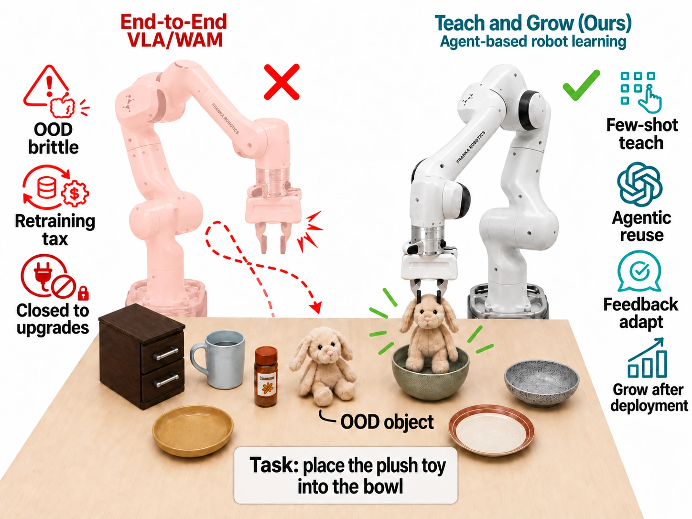
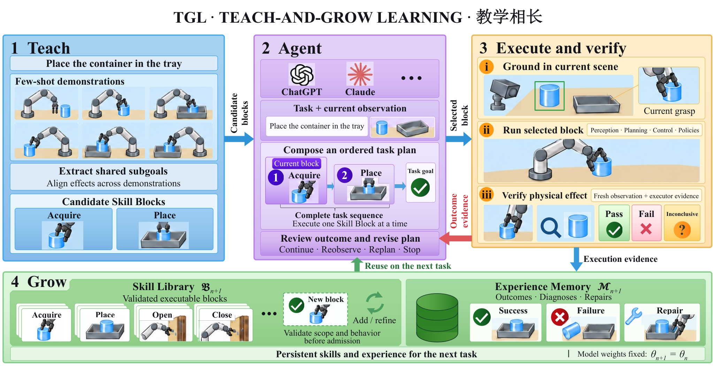
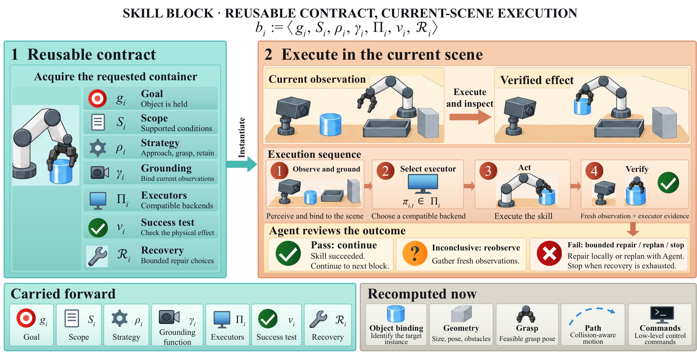
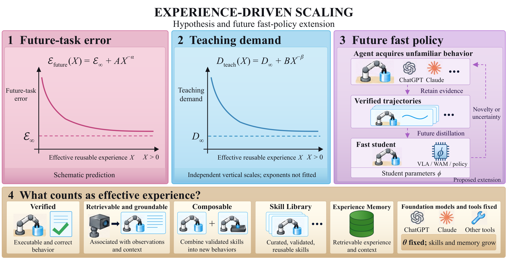
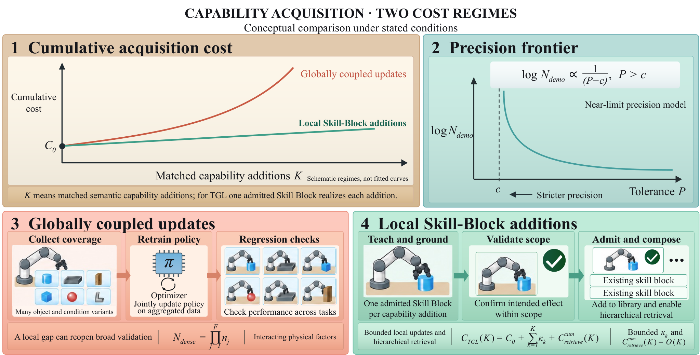
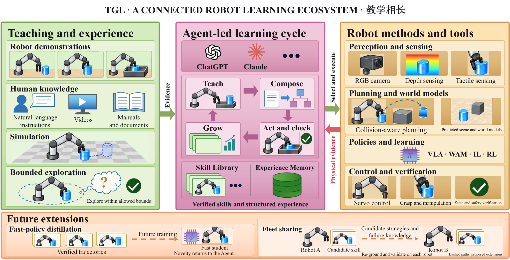

## 不更新模型权重，机器人如何学会新任务？

机器人遇到陌生物体，或原本有效的抓取方式失效时，适配学习式策略通常需要补采交互数据、重新优化参数，并检查已有任务是否受到影响。Teach-and-Grow Learning（TGL）研究另一种能力获取方式：保持预训练模型权重不变，将新行为组织成可检查、可复用的显式技能。

TGL 由 AI 智能体把少量教学转化为闭环**技能块（Skill Block）**，根据当前场景确定对象和几何参数，调用机器人工具，检查物理结果，再把验证过的行为留给后续任务。v2 论文报告的平均成功率为 **LIBERO 99.9%**、**LIBERO-Plus 92.4%**。

[阅读 arXiv v2](https://arxiv.org/html/2608.17209v2) · [项目网页与演示视频](https://tgl.changnie.top/) · [代码](https://github.com/IRMVLab/TGL)

## 一个局部失败，为什么会带来新一轮训练？

机器人经验需要通过真实或仿真的交互获得。物体位姿、相机视角、杂乱程度、材质和机器人本体还会相互影响，分别覆盖每个因素，并不等于覆盖它们的组合。一次少见的接触失败可能只需要一条具体修正，但通过共享策略参数吸收这条经验，往往又要经历数据采集、优化和回归验证。论文把这项反复出现的成本称为**重训练税（retraining tax）**。

TGL 将修正保存在可单独检索的行为中。每个技能都有适用范围、执行策略和结果检验；一次失败则可以留下需要避开的条件或可采用的恢复办法。已有策略提供的物理先验仍然有用，也可以作为技能块的执行器接入系统。

## 权重不变，变化的是什么？

**Training-free 指新任务的能力获取过程无需训练：**不进行梯度更新、微调或强化学习。智能体与机器人专用模型可以事先经过预训练；新任务到来后，更新的是技能库和经验记忆。

论文实现使用 **OpenAI GPT-6 Astra** 进行多模态推理，由 **Codex** 将智能体连接到机器人工具。智能体决定子目标、请求观测、选择工具，并根据结果修改后续路线；感知、抓取、运动规划、伺服与控制模块负责度量几何、接触处理和连续控制。

这一分工来自直接用智能体控制机器人的尝试：观察场景、调用工具、查看结果、继续调整。没有示范时，这个循环也能完成任务，但反复探索需要更多交互和模型调用。教学提供一条有效的初始路线，帮助探索集中于尚未解决的部分。因此，教学是能力获取的加速器，并非智能体控制机器人的必要前提。

## 从教学到执行，再把经验带入下一次任务

1. **教学。** 按示范达成的状态变化进行对齐，提取共享子目标和策略，同时保留不同教学来源所提供的证据。
2. **组合与执行。** 检索适用的技能块，根据新观测确定对象和几何参数，执行一个有明确意义的阶段。
3. **检验。** 对照预期效果检查实际结果，决定继续、重新观察、修复路线、请求针对性教学或停止。
4. **积累。** 将验证过的行为纳入技能库，将适用条件、结果、诊断和修复写入经验记忆，共同支持下一次任务。

成功示范提供可复用的策略，失败揭示策略需要调整的条件。随着技能库逐步完善，教学可以聚焦缺失的衔接或陌生工具，不必每次都从完整任务开始。

## 技能块保留预期效果，运动由当前场景决定

以把碗放到盘子上为例，不同示范的接近方向和运动路径可以不同，但共享的效果较为稳定：取得指定的碗、确认已经拿稳、建立目标位置关系，再释放物体。TGL 保留这层结构，在执行时重新计算物理实现。

一个技能块包含七项内容：**子目标、适用范围、可复用策略、场景绑定函数、兼容执行器、结果检验和有限的恢复选项**。结果检验返回通过、失败或不确定。技能块内部可以包含多轮感知与动作，其边界取决于有意义的状态变化，而非固定时长。

可复用策略不保留示范中的世界坐标、像素、旧路径、关节轨迹或底层动作重放。适用范围也需要通过有变化的实例验证后才能扩大。例如，论文中归纳得到的抓取块仍限定于特定物体，没有直接成为通用的罐体抓取能力。

**技能库（Skill Library）**保存可执行行为；**经验记忆（Experience Memory）**保存任务背景、选择条件、结果、诊断和修复。分开存储，使智能体既能找到技能，也能找到判断它是否适用的依据。保存一个回合的经历，并不自动意味着获得了一个经过验证的技能。

## v2 论文的实验结果

论文在 LIBERO 及其扰动扩展基准 LIBERO-Plus 上评估任务成功率。下表对应论文表 I、表 II 中 TGL 的结果；两组均值分别对四个任务套件、七类扰动等权平均。

| LIBERO 任务套件 | 成功率 |
| --- | ---: |
| Spatial（空间关系） | 99.7% |
| Object（物体） | 100.0% |
| Goal（目标） | 100.0% |
| Long（长程任务） | 99.9% |
| **平均** | **99.9%** |

在表 I 比较的方法中，TGL 与 LaST-R1 的 LIBERO 平均成功率并列最高。

| LIBERO-Plus 扰动类别 | 成功率 |
| --- | ---: |
| 相机视角 | 87.3% |
| 机器人初始状态 | 90.7% |
| 语言指令 | 96.8% |
| 光照 | 97.3% |
| 背景 | 97.4% |
| 传感器噪声 | 89.9% |
| 物体布局 | 87.2% |
| **平均** | **92.4%** |

TGL 的 LIBERO-Plus 平均成功率为表 II 所比较方法中的最高值。相机和传感器噪声下的表现也反映了视觉场景绑定仍有改进空间。完整对比与基线来源见[论文实验部分](https://arxiv.org/html/2608.17209v2#S5)。

控制实验进一步检查了技能如何形成、保存和影响后续执行：

**示范分解。** 10 段视觉示范通过确定性分解得到抓取与释放阶段，20 个可观测效果均得到确认。

**任务专用技能的持久保存。** 3 条教师轨迹产生两个技能块，在 3/3 个评估状态上成功；保存并重新加载后仍为 3/3。超出已学习范围时，在首个未达成的效果处停止。

**反馈驱动执行。** 两条代表性成功轨迹分别展示了抓取后调整剩余路线，以及抽屉开启结果不确定时请求新观测。

**固定执行器的技能库试验。** 技能库从 6 个块扩展到 8 个块后，成功数从 0/6 提升至 4/6；模型权重、运行系统和评估预算保持不变。

最后一项是针对两个任务的局部技能增长试验，样本规模与用途不同于前面的基准评测。详细协议、不确定性估计和能力获取成本见附录 I；执行视频可在[项目网页](https://tgl.changnie.top/)查看。

## 随可复用经验增长的能力

TGL 将有效可复用经验视为部署后能够继续增长的资源。这里的经验必须经过验证，并且仍可检索、可绑定到当前场景、可与其他技能组合。重复保存许多相似回合可能贡献有限，而一个缺失的衔接技能可能打开多条新的组合路线。

论文提出的缩放假设是：随着这类经验增加，相关未来任务的错误率和所需教学量分别趋近各自的下限。下图是待检验假设的示意曲线。

配套的成本分析讨论了技能增长何时能保持局部性。接近加和的增长成本依赖于边界明确的接口、局部验证，以及至多线性增长的检索成本。如果每加入一种能力，都要重新覆盖因素组合并进行大范围回归检查，获取成本就可能随能力范围加速上升。

## TGL 如何接入机器人系统

人类指令、机器人示范、仿真和视频可以提供教学证据，学习式策略与专用工具提供执行能力。智能体围绕子目标和物理结果组织这些资源，技能库与经验记忆则让本次任务的收获进入下一轮学习。

陌生任务需要多轮推理和观测，因此存在执行延迟。论文提出，可用验证过的轨迹训练快速学生策略，并在其不确定时将控制权交回智能体。这一后续训练阶段与无需训练的新任务获取分开。群体共享和跨本体复用也需要接收端重新进行场景绑定与验证；本文报告的研究基于单一本体的 LIBERO 仿真。

这项工作的目标，是让一次教学留下可以再次使用的能力：获得行为、验证效果，再把技能和经验带入后续任务。
