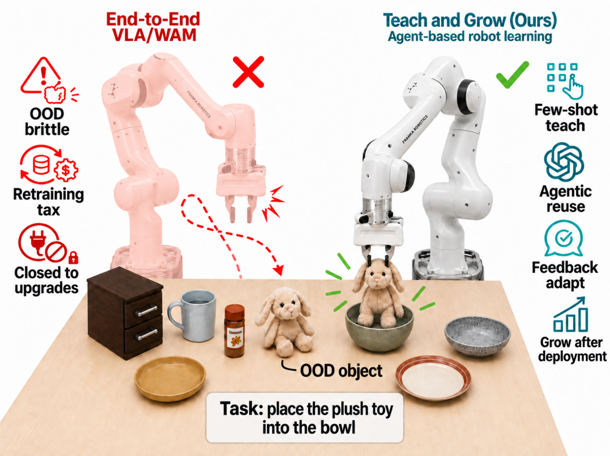
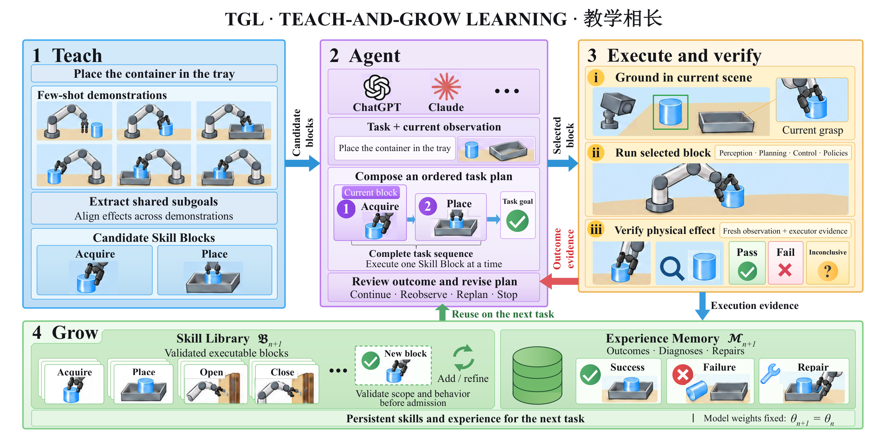
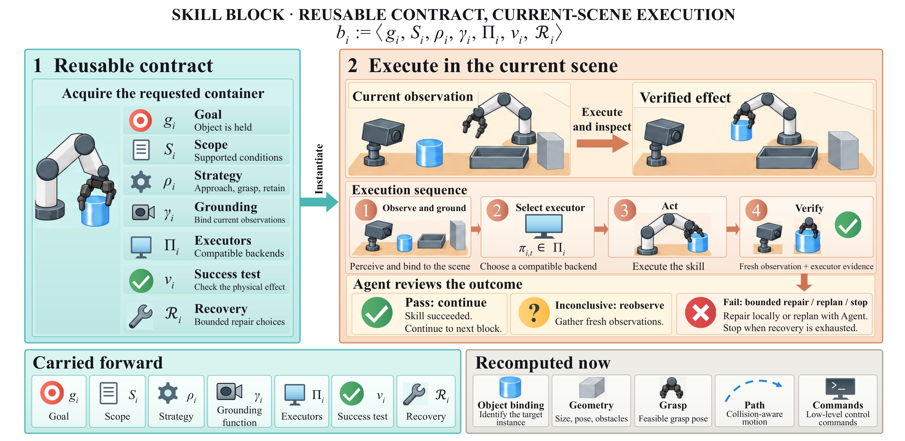
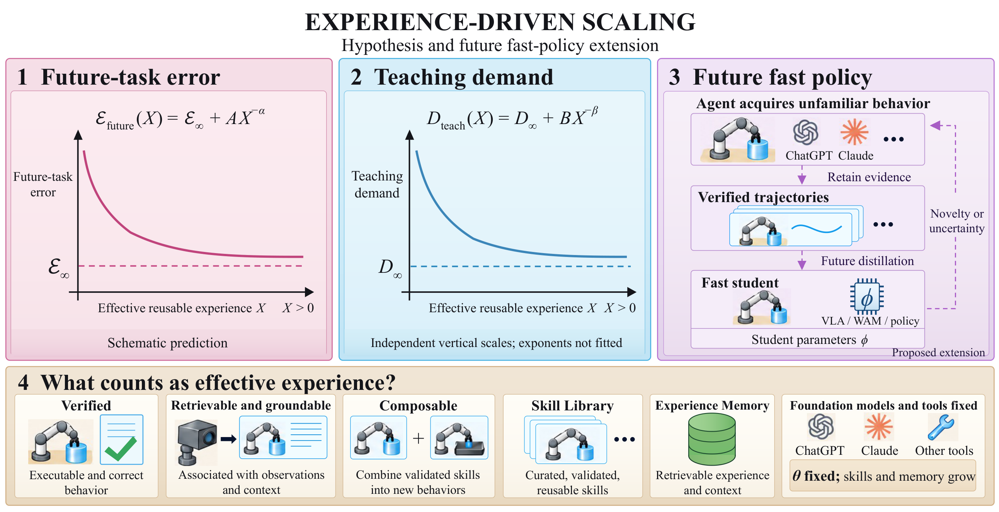
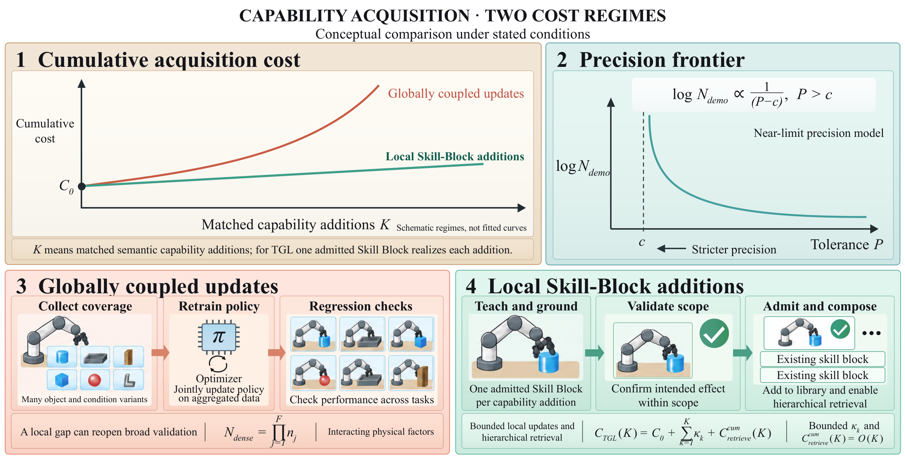
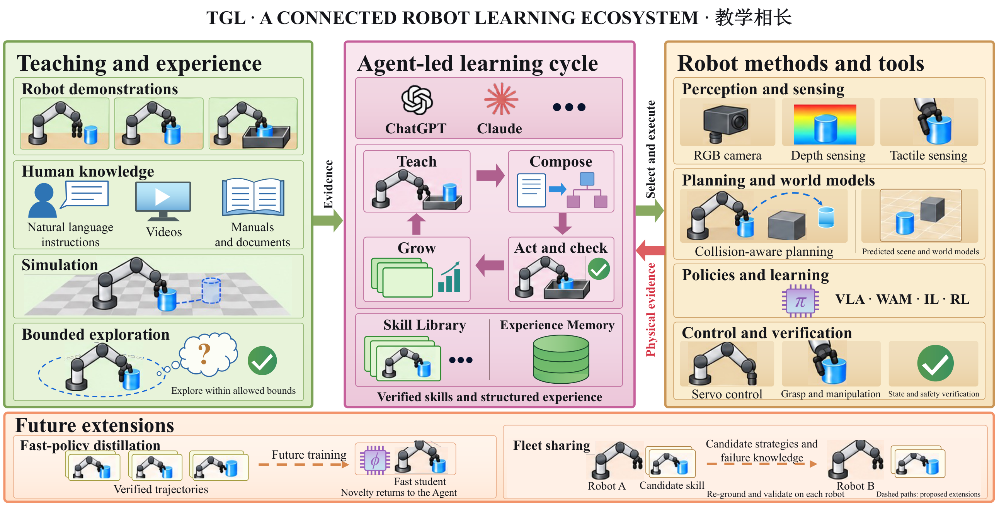

## 少量示教，留下可以再次使用的技能

Teach-and-Grow Learning（TGL）是一种面向通用机器人学习的免训练架构。预训练模型权重保持固定，少量成功演示转化为可复用的机器人技能。AI 智能体组织任务，将技能落实到当前场景，检查机器人实际完成了什么，再把行为和经验带入下一次任务。

**示教 → 执行与验证 → 积累。** 示教提供子目标与共同结构，物理反馈指导执行和恢复，持久化的技能库与经验记忆让一次任务的收获成为下一次任务的起点。

[阅读论文 · arXiv](https://arxiv.org/abs/2608.17209) · [项目网页与演示视频](https://tgl.changnie.top/zh/) · [代码](https://github.com/IRMVLab/TGL)

## 端到端机器人学习的成本从哪里来？

机器人遇到新的容器、变化的相机，或不再奏效的抓取。缺口可能很小，但通过策略更新修复它，通常意味着补采数据、再做一轮优化，并检查策略此前支持的行为是否受到影响。项目将这项反复出现的负担称为**再训练成本（retraining tax）**。

物理交互数据与文本、代码的成本结构不同。接触需要被观察，抓取需要实际尝试，动作造成的变化需要被检查。物体位姿、相机几何、杂乱程度、材质和机器人本体还会相互影响，覆盖单个因素并不等于覆盖它们的组合。

TGL 由此提出一个问题：能否把修正保留为显式对象，让行为有明确的适用范围，失败条件可以检查，恢复规则可以单独修改？机器人基础模型继续提供先验，TGL 改变的是新任务知识的存放位置。

## 从能够规划的 AI 智能体，到能够积累能力的机器人

这项工作始于直接让 AI 智能体通过感知、抓取、规划与控制工具驱动机器人。没有示教，智能体也能完成任务。接下来的问题是：这一回合结束后留下什么？下一次是否还要重新推理同一件事，还是可以检索已经验证过的行为？

TGL 保留观察、行动、检查结果的智能体循环，并让其中有用的收获持续存在。成功任务形成带有适用范围与效果判据的技能块，条件和修复方式进入经验记忆。后续任务可以检索共同结构，再通过执行解决当前场景中的变化。

少量示教提供有效的起点。成功演示提前给出子目标顺序，使探索集中在尚未覆盖的变化、纠错和衔接上。**示教是加速器，不是前提。** 机器人轨迹、仿真、人类视频和书面流程都可以提供证据；不同来源保留各自的信息边界，具体行为仍需在机器人上落实与验证。

## 把可执行的能力本身作为学习对象

一次演示里有两样东西：值得保留的策略，以及只属于那个场景的物理细节。TGL 把它们分开。

以“把碗放到盘子上”为例，不同演示的接近方向与运动轨迹可以不同，但共同结构更稳定：拿到指定的碗，确认它被夹持，朝目标关系移动，再把它释放到盘子上。**Skill Block（技能块）**保留预期效果、可复用策略、适用条件与结果检验。实际的物体姿态、抓取、路径和控制目标来自当前观察。

这里的 **training-free（免训练）** 含义很明确：获取当前任务的过程不包含梯度更新、微调或强化学习阶段。AI 智能体与专用模型可以已经是预训练好的；获取过程中改变的是显式的技能与记忆状态。

## 上层围绕子目标推理，下层完成几何与控制

AI 智能体在有意义的状态变化处组织任务；每个技能块内部，由专用执行器处理几何与连续控制。

**把演示读成状态变化的证据。** 片段按完成的效果对齐，即使时间与动作方式不同。共同结构成为候选策略，演示之间的变化决定其适用范围。

**让技能与当前场景建立明确契约。** 技能块说明期望的效果、适用条件、所需证据、兼容执行器、效果判据和允许的恢复动作。以抓取为例，夹爪闭合并不足以说明物体已被夹住，验证必须指向预期的物理效果。

**机器人动作后，再决定剩余计划。** 效果通过，进入下一阶段；效果失败或不确定，就可能需要再次观察、换一个执行器或修改路线。下一步取决于刚才真正发生了什么。

**验证通过后，候选行为才进入复用流程。** 系统在示教之外的场景中检查适用范围、执行器兼容性、效果判据与恢复方式。不够可靠的候选先收窄范围或修复，通过后再进入技能库。

实现使用 **OpenAI GPT-6 Astra 和 Codex** 进行任务级推理与工具交互。检测、分割、RGB-D 几何、Contact-GraspNet、MPLib 与控制器负责物理场景落地和执行。智能体由此可以组织任务，专用工具则提供实际操作所需的度量结果。

## 技能保存行为，记忆保存使用它的经验

**技能库（Skill Library）**保存能够被选择并运行的行为：子目标、适用条件、场景落实规则、兼容工具与验证逻辑。单有一句“如何抓取”的描述并不够，技能块还必须把意图接到执行器，以及一个能检验效果的判据上。

**经验记忆（Experience Memory）**保存使用情境：任务、选中的技能块、观察、结果、诊断与修复。一次失败可能暴露出不合适的抓取方式或一次含糊的观察；保留这些解释，就能指导下一次选择，而不必把每个回合都变成新的可执行技能。

这种分离也让系统保持可检查。人可以收窄过宽的范围、修改恢复规则，或把某个工具版本标为不兼容。机器人则可以同时检索行为，以及让这个行为适用的条件。

## 让真正能够复用的经验持续增长

存储更多轨迹并不必然带来更多能力。只有能够在新场景中被检索、落实和组合的经验，才具有复用价值。Teach-and-Grow 假设将这种**有效可复用经验**与未来任务误差、相关任务示教需求的下降联系起来。

同样的思路也体现在局部更新上。如果场景落实、验证、兼容性检查和检索成本保持可控，增加技能块就可能避免重新更新整个学习系统。论文分析了局部技能更新改变能力获取成本所需的条件。

## 将 VLA、WAM 与机器人工具组织到同一学习系统中

TGL 提供由 AI 智能体驱动的运行层，组织学习策略与经典机器人方法。训练好的策略可以执行技能块，几何规划器可以连接两个技能，视觉伺服可以完成局部闭环，触觉可以加强接触检查。智能体选择这些能力、读取执行结果，并决定什么值得保留下来。

拟议的“慢教师–快学生”路径延续这一分工。智能体通过观察、推理与工具调用获取陌生行为，过程中形成的已验证轨迹可以为快速策略提供训练数据，让成熟行为以策略速度执行。快速策略遇到陌生条件时，控制权可以回到智能体，由它诊断缺口并扩充技能库。

方法的贡献在于把这些环节连接成同一个学习循环：少量示教、显式闭环技能、权重固定的执行、物理反馈与经验积累，通过共同接口协同工作。完成一次任务后，机器人留下可以检索、检查和再次执行的能力。

## 从执行中观察方法

论文在 LIBERO 与 LIBERO-Plus 中研究这套方法，考察示范如何成为技能、一次任务结束后留下什么、反馈如何改变下一步决策，以及技能库扩充如何支持相关任务。[对照演示视频](https://tgl.changnie.top/zh/#demos)展示了不同抓取方式如何达到相同目标，也展示了一次未成功的尝试如何引出重新观察与恢复。

实验协议、定量结果与方法对比请参阅[论文](https://arxiv.org/abs/2608.17209)。
