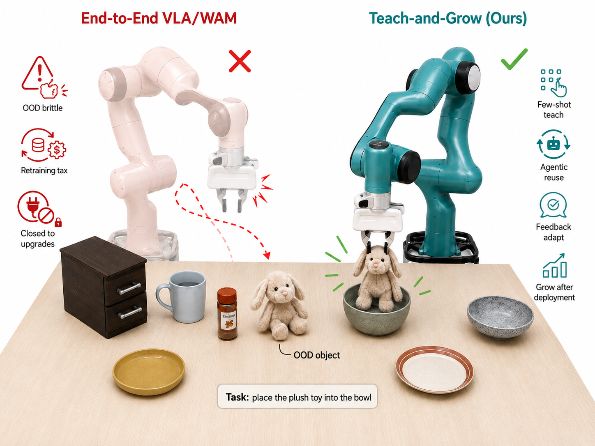
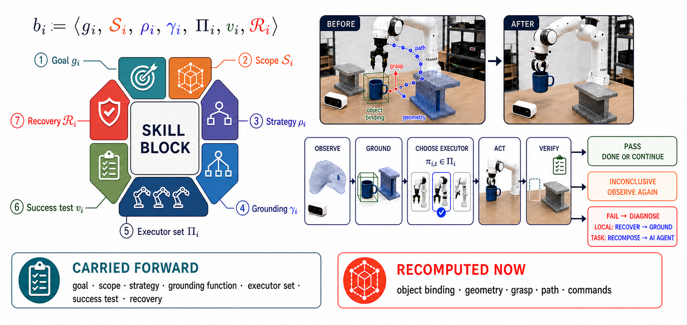
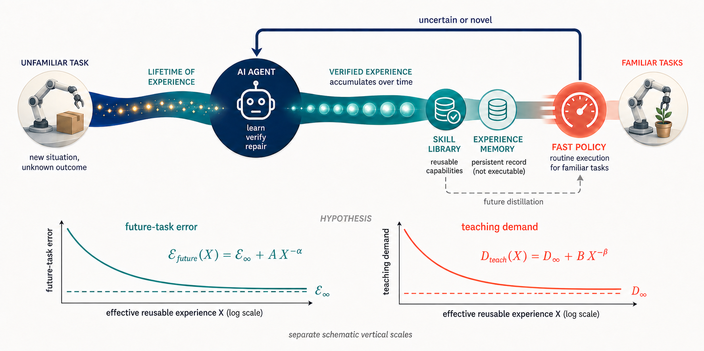
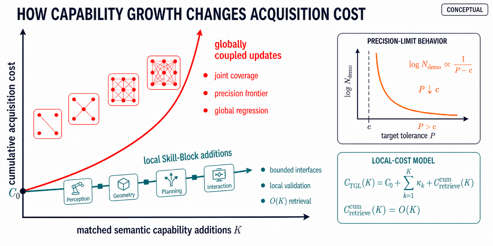
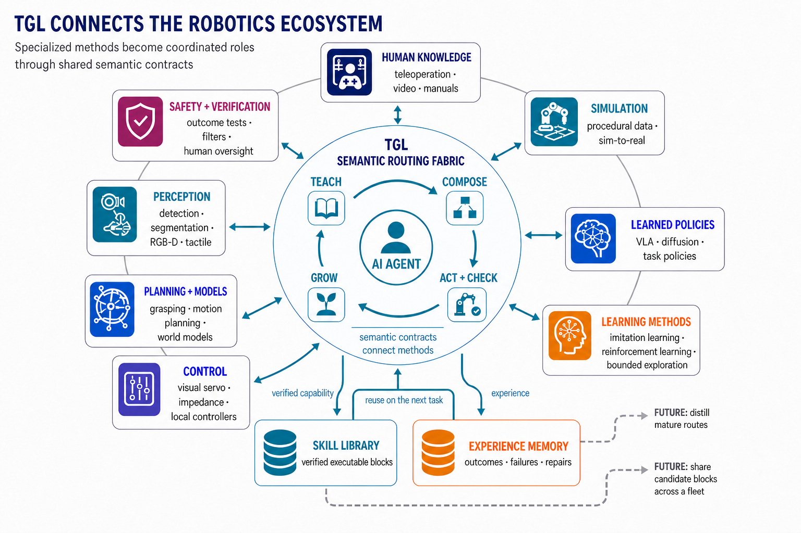

## 一页速览

| 问题 | Teach-and-Grow Learning（TGL） |
|---|---|
| 陌生任务如何获得？ | 从多个成功示范中提取共享语义阶段与可复用行为 |
| 保存什么？ | Skill Library 中的闭环 Skill Block，以及 Experience Memory 中的结果与修复 |
| 谁负责运动控制？ | 机器人原生策略、规划器、伺服与控制器，而不是自由文本输出 |
| 执行如何适应变化？ | 智能体完成一个有意义阶段、观察物理结果，再继续、修复或请求定向教学 |
| 状态 | 预印本；投稿 IEEE Transactions on Robotics 审稿中 |

当前通用机器人策略主要把知识吸收到模型权重里。当新物体、新模态或新失败超出已有覆盖时，通常需要重新采集数据并训练。这条路线非常适合可扩展的快速执行，却也让一条局部经验变得昂贵：学习一次陌生放置，可能要更新一个已经掌握数百种无关行为的模型。

Teach-and-Grow Learning 提出另一种生命周期：机器人应能局部学习一项新能力，在物理世界中验证，把它保存为可寻址对象，并在学习下一个相关任务时复用。

## 示范是证据，不是待回放的轨迹

TGL 从少量成功示范 $\mathcal{D}$ 出发。智能体按照有意义的状态变化对齐它们——获得物体、打开容器、到达目标——并寻找跨示范共享的结构。最终保存的不是一串复制动作，而是一种能在新场景重新物理实例化的语义策略。

一个 Skill Block 表示为

$$
b_i=\langle g_i,\mathcal{S}_i,\rho_i,\gamma_i,
\Pi_i,v_i,\mathcal{R}_i\rangle,
$$

其中 $g_i$ 是子目标，$\mathcal{S}_i$ 是适用范围，$\rho_i$ 是策略，$\gamma_i$ 是定位需求，$\Pi_i$ 是可用执行器，$v_i$ 是结果验证器，$\mathcal{R}_i$ 是恢复行为。形式化的意义在于避免让“技能”退化成一条无结构文字：Block 必须说明什么应改变、当前场景需要怎样定位、哪种机器人工具被授权执行，以及如何检查成功。

## 动态组合，但保留明确运动边界

面对当前观测，智能体检索并定位 Block，形成路线

$$
\tau_t=(b_{i_1},b_{i_2},\ldots,b_{i_m}).
$$

它根据当前证据在学习式策略和几何工具之间选择。语义推理可以改变路线，但不直接下发关节位置；度量几何、碰撞检查、接触与连续控制仍由机器人原生执行器负责。这个边界允许通用智能体组织行为，又不会把“听起来合理的语言”当成电机权限。

执行在语义层采用后退视界形式：

1. 定位下一个 Block 所需的物体与关系；
2. 调用其授权执行器；
3. 观察物理结果并运行验证器；
4. 若预期效果出现则继续，否则重新观察、修复剩余路线、探索缺失能力，或请求定向教学。

代表性轨迹体现了这一区别：碗放盘任务中，中间效果改变剩余几何后智能体重新规划；抽屉操作中，移动后重新观察，而不是假定计划状态转换已经发生。这里的闭环是：**物理结果会改变下一次语义决策**。

## 两种持久存储，承担不同职责

验证通过的 Block 进入 **Skill Library**；结构化 **Experience Memory** 记录任务、上下文、所用 Block、结果、诊断、修复与证据。二者有意分离：记忆可以解释上次为何失败，却不能直接移动机器人；执行器可以移动机器人，却不知道何时应被使用。智能体把召回的经验和可执行能力连接起来。

第 $n$ 个任务后的学习状态可概括为

$$
\theta_{n+1}=\theta,
\qquad
(\mathcal{B}_{n+1},\mathcal{M}_{n+1})
=\operatorname{Update}(\mathcal{B}_n,\mathcal{M}_n,\mathcal{D}_n,\Delta_n),
$$

其中基础模型权重 $\theta$ 保持固定，Skill Library $\mathcal{B}$ 与 Experience Memory $\mathcal{M}$ 根据示范和验证结果 $\Delta_n$ 增长。架构因而具有两个时间尺度：缓慢的全局模型改善，与快速的局部能力获取。

## 面向可复用经验的尺度律假设

令 $X>0$ 表示有效可复用经验：已经通过验证，且在当前场景仍可检索、定位和组合的历史交互。论文提出——但尚未通过长期实验建立——如下假设：

$$
\begin{aligned}
\mathcal{E}_{\mathrm{future}}(X)&=\mathcal{E}_{\infty}+A X^{-\alpha},\\
D_{\mathrm{teach}}(X)&=D_{\infty}+B X^{-\beta},
\end{aligned}
$$

其中误差下限和教学下限非负，$A,B,\alpha,\beta$ 为正。它预测随着可复用经验增加，相关未来任务的误差和获取新任务所需的边际教学会下降。这是关于长期行为的研究假设，不能由下面的短期受控实验直接视为已经拟合验证的尺度律。

## 当前验证了什么

现有证据按机制检查组织，而不是混成一个笼统成功声明。

### 1. 示范能否揭示语义任务阶段？

十条视觉示范产生 40 个预测/参考阶段，顺序角色/类型准确率为 1.000。严格边界 F1 只有 0.100；容忍一个采样帧时升至 0.633，容忍两个采样帧时为 0.900。物体获得/释放效果在 20/20 个案例中被正确观察。

这说明该样本中语义顺序与效果恢复可靠，但精确时间边界较弱。如果只报告带容忍度的 F1，就会隐藏这一区别。

### 2. 新诱导的 Block 能否保存并复用？

来自训练状态 0–2 的三条教师轨迹诱导出两个可复用 Block。在留出状态 3–5 上执行 3/3 成功；保存并重新加载 Skill Library 后再次 3/3 成功。在更远的状态 6–8 上，系统发现所需语义效果缺失后停止，没有把不完整路线改名为成功。

停止本身是重要负证据：持久化在已示范能力范围内成立，而缺失语义行为仍是真实能力缺口。

### 3. 更丰富技能库能否降低固定执行器实验中的尝试次数？

受控比较固定运行时、执行器、随机种子与最多三次尝试。用于引导的案例 12–14 与评测案例 15–17 不重叠；在六次评测中比较六 Block 与八 Block 技能库：

| 技能库 | 中位尝试数 | 成功数 | 成功率 | 95% Wilson 区间 |
|---|---:|---:|---:|---:|
| 六个 Block | 2.5 | 0/6 | 0.00 | [0.00, 0.39] |
| 八个 Block | 1.5 | 4/6 | 0.67 | [0.30, 0.90] |

Fisher 精确检验 $p=0.061$。这是一个双任务、单随机种子、小规模机制实验；它与“有用 Block 可降低获取成本”一致，但不是尺度律假设的广泛统计证明。

### 4. 执行仍然失败时发生了什么？

另一个独立八次尝试队列得到 0/8 任务成功：两次在规划前停止，四次失败于路径/标定，两次失败于夹爪。这些案例必须保留，因为智能体架构不会自动消除具身执行故障。它们明确指出几何标定、规划与末端执行器可靠性仍需改善。

## 能力获取成本与更大的学习生态

架构观点不是“智能体取代策略”。一旦 Block 稳定，VLA、世界—动作模型或其他快速策略可以直接执行它，也可以从验证轨迹中蒸馏。智能体最适合处理不断变化的能力边界；学习式快路径仍适合熟悉条件。

这种不对称也使改进局部化：抓取检测器可以在一个 Block 内替换；恢复动作可以附着到失败效果；新验证器可以收紧准入，却不改动无关技能。成长是积累经过检验、可寻址的能力，而不是生成越来越长的语言计划。

## 适用范围、局限与未决主张

当前智能体路线慢于蒸馏策略，也依赖机器人原生工具的可靠性。示范诱导边界对容忍阈值敏感；固定执行器证据分母很小；独立 0/8 队列说明规划、标定和夹爪会主导整体成败。所提出的幂律关系尚未在长任务序列上验证；跨具身泛化与安全自主探索也需要更大规模研究。

论文另行报告标准基准结果，但本博客重点呈现机制、分母和失败类别均明确的受控证据。当前最强结论是架构性的：少量教学、效果验证 Skill Block、物理反馈与持久记忆，可以组成一个无需任务专用策略重训的机器人学习循环。这个循环是否会形成稳定的终身尺度律，仍是开放实验问题。
