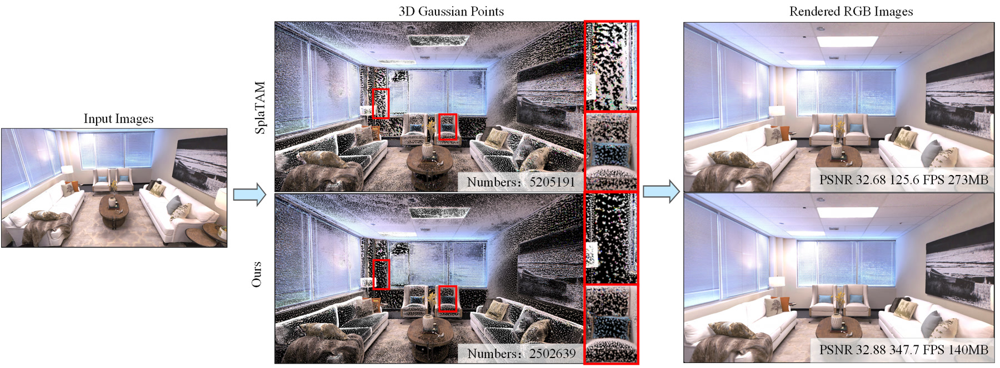
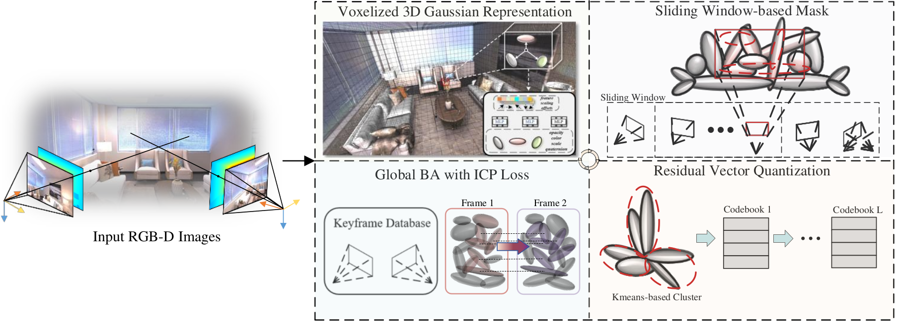
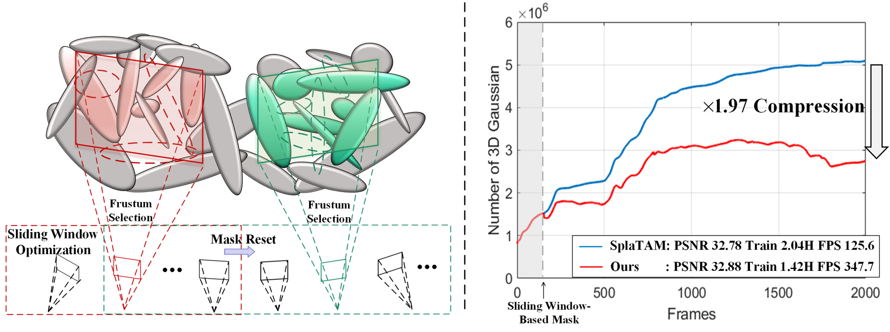
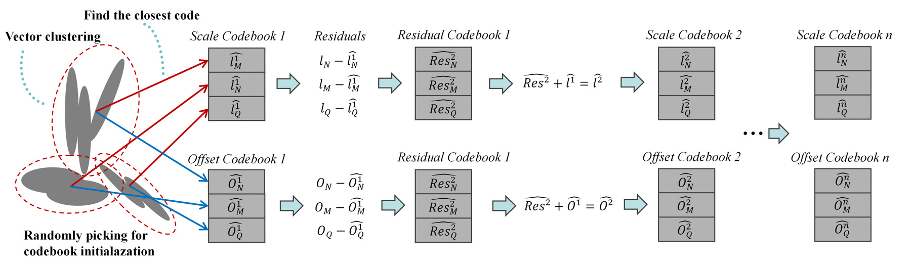
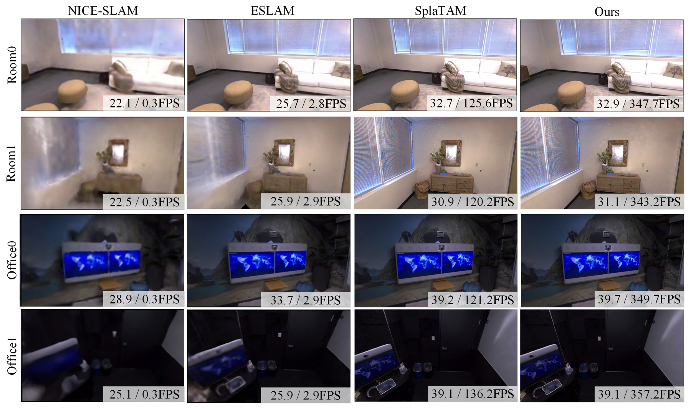
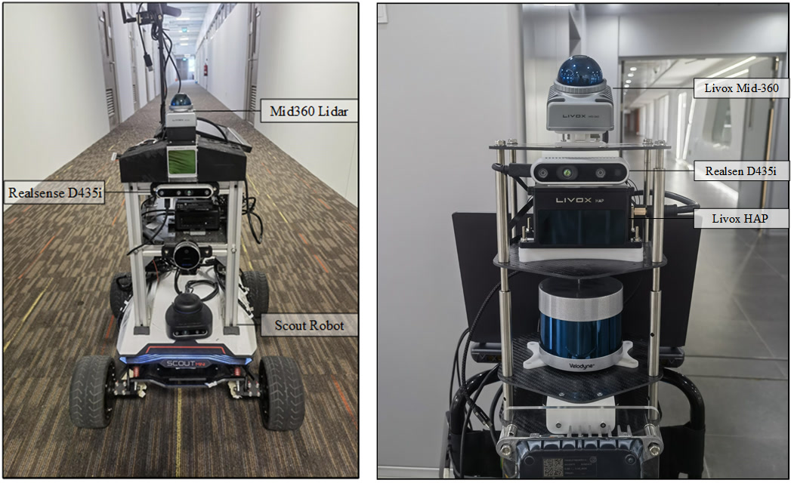
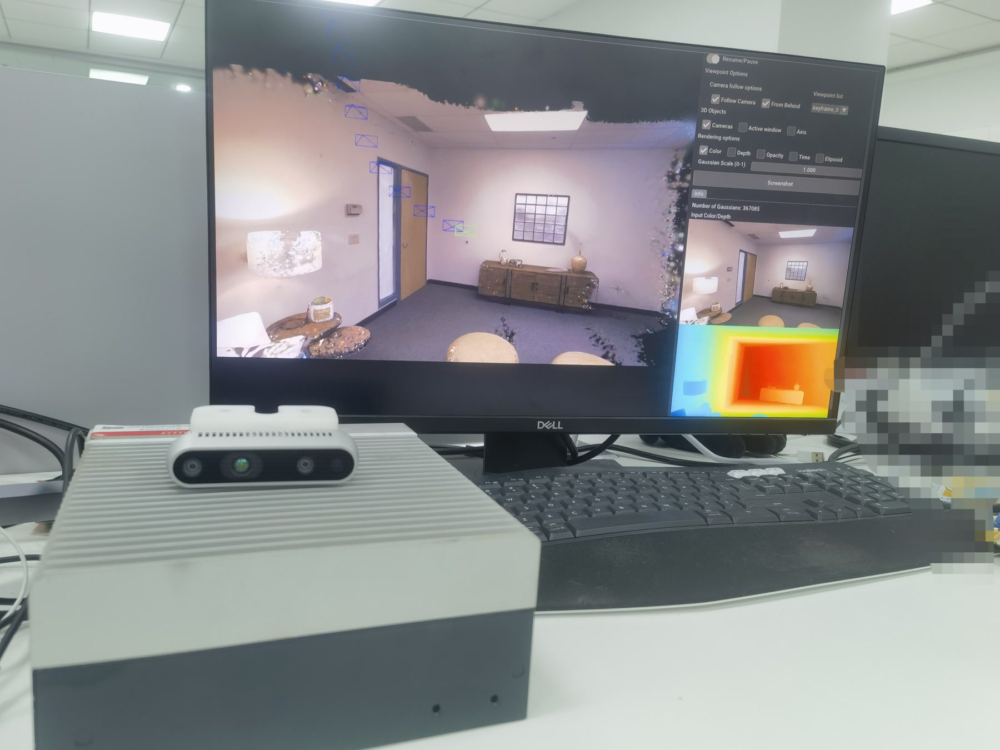

## 工作概览

| 问题 | VCGS-SLAM 的设计 |
|---|---|
| 高斯 SLAM 地图为何开销较大？ | 在线顺序优化会产生大量几何形态相近或重复的高斯基元 |
| 如何控制地图增长？ | 体素锚点组织新增高斯，可学习滑动窗口掩码在线移除低价值基元 |
| 如何压缩属性？ | 残差向量量化为重复的锚点几何保存紧凑码本索引 |
| 如何稳定跟踪？ | 全局关键帧数据库支持结合 RGB、深度、轮廓与 ICP 损失的局部到全局束调整 |
| 在哪些环境中验证？ | Replica、ScanNet、TUM RGB-D、嵌入式计算平台与多传感器移动机器人数据集 |

这项工作已于 **2026 年被 International Journal of Computer Vision（IJCV）接收**。研究聚焦稠密神经 SLAM 的实际部署瓶颈：高质量地图在持续更新后会占用大量存储与计算资源。系统保留三维高斯泼溅的显式高速渲染能力，同时控制地图增长、压缩重复几何属性，并通过全局几何优化提高相机跟踪稳定性。

## 在线 SLAM 带来的表示冗余

三维高斯泼溅使用椭球基元表示场景，其协方差编码朝向与尺度。稠密高斯 SLAM 随 RGB-D 帧到达不断新增并优化这些基元。顺序数据处理与选择性关键帧更新会形成不同于离线 3DGS 全局优化的表示分布。论文通过归一化 KL 散度分析协方差相似度，发现多种高斯 SLAM 系统的几何分布更为集中。

这一现象在重建地图中十分直观：移除大量高斯后，渲染结果仍能保持相近质量，同时减少光栅化计算和检查点存储。

## 相互耦合的建图与跟踪线程

系统输入为带相机内参 $K$ 的 RGB-D 序列 $\{I_i,D_i\}_{i=1}^{M}$。建图线程增量构造体素锚定高斯地图，执行在线掩码并量化重复属性；跟踪线程估计相机位姿，并定期利用更大的关键帧集合恢复全局一致性。

部署到机器人后，建图需要持续吸收新观测表面，同时约束表示规模；跟踪则需要复用足够的历史证据来抑制累计位姿误差。

## 体素锚定三维高斯表示

每一帧深度图首先生成点云，并被体素化为中心 $\mathbf{x}^{a}$。每个锚点保存学习特征 $\mathbf{f}^{a}$、尺度向量 $\mathbf{l}$ 和偏移 $\mathcal{O}$。对应的高斯中心为

$$
\{\boldsymbol{\mu}_i\}_{i=0}^{k-1}
=\mathbf{x}^{a}+\{\mathcal{O}_i\}_{i=0}^{k-1}\cdot\mathbf{l}.
$$

透明度、旋转、尺度与颜色由锚点特征、观察距离和方向共同解码。系统在新出现或重建不充分的区域增加锚点，并根据累计高斯梯度在多分辨率体素中分配容量，使表示能力集中到真正改善场景的区域。

## 随相机窗口移动的在线掩码

在线 SLAM 只能利用已经到达的观测，因此剪枝机制需要随相机移动。VCGS-SLAM 为局部窗口内的高斯分配可学习掩码；窗口由当前帧与重叠关键帧组成。视锥选择将优化限制在可见基元内，窗口重置则避免掩码梯度持续累积并最终删除有用几何。

二值掩码同时作用于高斯尺度和透明度，使剪枝考虑基元体积、可见性以及它对近期视图的贡献。在论文展示的序列中，该策略将高斯数量压缩 **1.97 倍**，同时维持重建质量。

## 残差码本压缩重复几何

协方差分析表明，大量高斯共享相似的尺度与偏移。残差向量量化首先使用一个码本近似属性向量，后续阶段继续编码尚未解释的残差：

$$
\hat{\mathbf{l}}_n^{(L)}
=\sum_{k=1}^{L}\mathcal{C}^{k}\!\left[i_n^{k}\right].
$$

地图因此只需保存较小的索引和共享码本，无需为每个锚点保留完整独立向量。论文配置采用大小为 64 的码本和六级残差量化，在紧凑性与重建保真度之间取得平衡。

## 结合 ICP 的局部到全局束调整

相机跟踪在可见像素上联合优化颜色与深度重建损失。ICP 项连接高斯中心与邻近几何，在纯光度证据较弱时加强空间对齐。稀疏全局关键帧数据库提供历史射线，用于联合优化地图与相机位姿。该调度方式无需在每一步重复处理全部历史帧，也能针对长轨迹的累计漂移进行校正。

## 重建质量、速度与内存

实验在 Replica、ScanNet 和 TUM RGB-D 上评估相机跟踪、渲染质量、表面重建、运行速度与存储，并将紧凑表示模块接入现有高斯 SLAM 基线。

| Replica 配置 | 渲染 FPS $\uparrow$ | 检查点内存 $\downarrow$ |
|---|---:|---:|
| SplaTAM | 175.64 | 273.09 MB |
| SplaTAM + 紧凑模块 | **398.45** | **117.36 MB** |
| MonoGS | 317.45 | 84.41 MB |
| MonoGS + 紧凑模块 | **447.29** | **73.31 MB** |
| Gaussian-SLAM | 321.39 | 101.48 MB |
| Gaussian-SLAM + 紧凑模块 | **458.53** | **96.03 MB** |

这些结果说明紧凑表示能够作为可复用的系统组件。论文报告最高 226% 的渲染速度提升和超过 2.21 倍的内存压缩，同时保持有竞争力的重建质量。

## 嵌入式验证与机器人数据

系统在 Jetson 与笔记本级嵌入式平台上完成测试。作者还使用搭载 RGB-D 相机、IMU 与 Livox 激光雷达的移动机器人采集室内外序列，使表示压缩研究与真实机器人所面对的算力和传感约束建立联系。

## 适用范围与当前限制

系统使用 RGB-D 输入并假设相机内参已知。快速运动会同时模糊彩色与深度观测，削弱跟踪损失；大量动态物体也可能在以静态场景为主的地图中引入伪影与漂移。后续工作可进一步结合运动感知观测与显式动态场景建模。
